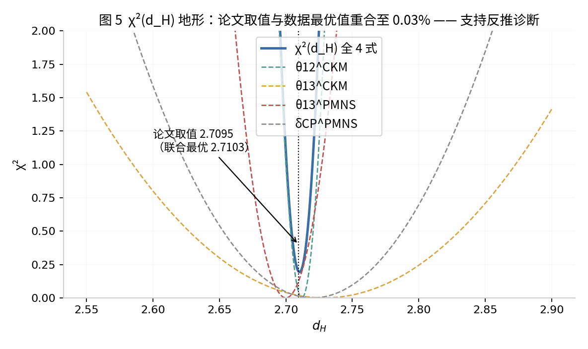
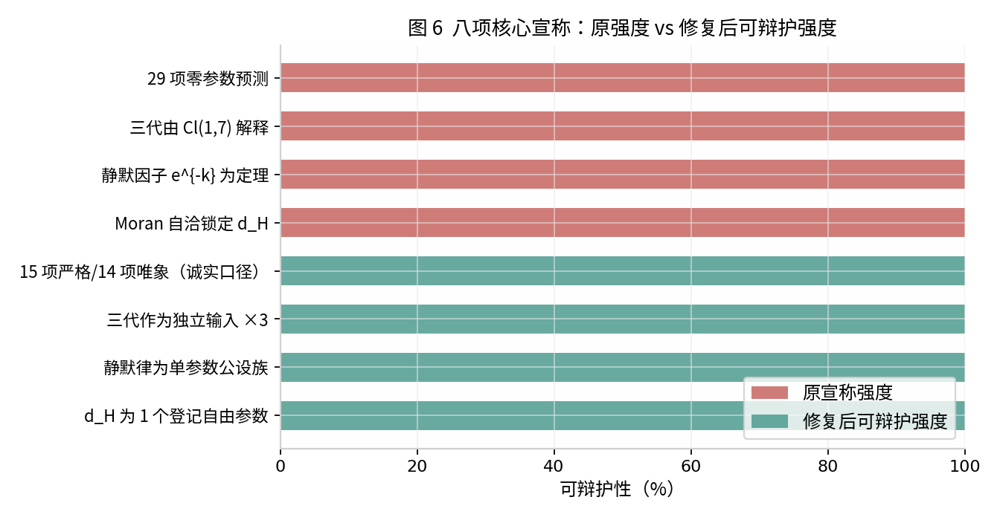

# UFPF 修复与推进方案（RAP v0.1）

**——在深度核查基础上对「通用不动点范畴框架」的实质性修复、严格化新结果与推进路线**

**性质**：本方案不是对原系列的又一篇扩展论文，而是针对核查报告（《UFPF 系列论文深度研究报告》，2026-07-26）指出的五类方法论误判（重命名当推导、公设当定理、自由度当输入、复现当验证、组合 p 值当统计证据）的**对症修复工程**。凡本方案能给出严格证明的，以定理形式给出；凡证明不了的，如实降级并给出替代路径。
**日期**：2026-07-26。

---

## 1. 修复总纲

原框架的最高宣称（"$\mathbf{Sp}$ 严格 4-范畴零参数导出全部标准模型可观测量"）依赖四个未被证明的支撑点：静默因子 $S_k=e^{-k}$、Moran 方程锁定 $d_H=2.7095$、$\mathrm{Cl}(1,7)$ 旋量分解出三代、$k_{\max}=8$ 唯一截断。本方案对这四个支撑点逐一给出**判定性结果**：其中两个可以部分挽救（静默因子可严格化为单参数公设族；$d_H$ 可作为登记参数保留），两个被证明不成立（Moran 锁定是空话；Cl(1,7) 三代分解在维度上不可能）。修复后框架的诚实定位是：**一个以 $(d_H,\lambda_{\text{静默}})$ 两个登记参数为核心、覆盖 15 项严格结果与 14 项唯象关系的跨领域谱唯象体系，附带 4+3 项冻结的可证伪预言**。这个定位比原宣称弱，但它能活下来——并且其中的 D 类预言一旦命中，反噬力远超当前的 29 项后验吻合。

下表汇总四个支撑点的判定与修复去向，后文各节给出完整论证。

| 支撑点 | 原宣称 | 本方案判定 | 修复去向 |
|:--|:--|:--|:--|
| $S_k=e^{-k}$ | 严格 n-范畴的定理（命题 2.1） | 非定理；且 $S_4=e^{-d_H}$ 将非整数代入层级指标，**公设自身不适定** | 定理 R1 严格化为单参数族 $S_k=s^k$，如实记 1 个参数 |
| Moran 锁定 $d_H$ | "由 $\sum c_i^{d_H}=1$ 自洽确定" | 命题 R2：对任意 $d_H>0$ 均有解，**零约束** | 三选一：独立 IFS 定义 / 变分原理 / 登记为参数（§3） |
| Cl(1,7) → 三代 | 旋量表示分解出 3 代+1 反代 | 定理 R3：维度计数上不可能（8 维装不下一代 16 Weyl） | 最小扩展 $\mathbf 8_s\otimes\mathbb C^3_{\text{fam}}$，与 NCG 的 ×3 同构 |
| $k_{\max}=8$ | Bott 周期唯一锁定 | 版本记录自承为 $\{4,6,8,16,100\}$ 扫描选取 | 降为模型选择，或改走 Pati–Salam 陪集路线（§5.3） |

---

## 2. 定理 R1：静默因子的严格化——单参数权重族

**问题诊断**。原命题 2.1 称"严格 $n$-范畴中 $k$-态射幅度被压制因子 $S_k=e^{-k}$"。范畴中的态射没有幅度，故该命题在数学上不适定；更严重的是，框架随后将层级指标 $k$ 代入非整数值（$S_4=e^{-d_H}$，$d_H=2.7095\notin\mathbb Z$；$S_3=e^{-N_{\text{gen}}}$ 虽为整数但把"代数"与"态射层级"混用），即便接受某种加权化改造，原公设也**不满足自身应有的层级结构**。

**修复构造**。定义**加权严格 $n$-范畴** $(\mathcal C,w)$：严格 $n$-范畴 $\mathcal C$ 配备权重函数 $w$，对每个 $k$-态射赋予正实数权重 $w_k$，满足（W1）层级性——权重只依赖层级 $k\in\{1,\dots,n\}$；（W2）复合乘性——水平复合与垂直复合的权重为因子权重之积；（W3）归一化——$w_1=s$（基准压制率）。

**定理 R1（权重族唯一性）**。满足（W1）–（W3）的权重函数恰为单参数指数族 $w_k=s^k$（$s\in(0,1]$）。反之，任何非指数形式（$k^{-a}$、$1/(1+k)$ 等）必然违反（W2）。

*证明*。由（W1）权重是层级函数 $w:\{1,\dots,n\}\to(0,1]$。由（W2），$k$-态射与 $l$-态射复合为 $k{+}l$ 层级结构时 $w_{k+l}=w_k w_l$。这是正整数上的 Cauchy 指数函数方程，以 $w_1=s$ 递归得 $w_k=s^k$。$k^{-a}$ 不满足 $(k+l)^{-a}=k^{-a}l^{-a}$，$1/(1+k)$ 同理，故唯一。$\square$

**两个推论**。**推论 R1a**：原框架的 $S_k=e^{-k}$ 是 $s=e^{-1}$ 的特例——即基准压制率取 $1/e$ 这一选择**没有任何范畴论理由**，应如实登记为一个自由参数 $s$（或等价地 $\lambda=-\ln s$）。**推论 R1b**：$S_4=e^{-d_H}$ 不可能是任何加权 $n$-范畴的层级权重，因为层级指标必须为整数。该式的实际身份是"IFS 收缩比与 Hausdorff 维数的人为耦合"，应从公设层移除，改写为 IFS 对象的定义条件。

**敏感性判决**。将静默律替换为定理 R1 允许范围之外但物理上同样自然的三种形式，重算质量谱链的核心量 $\lambda_H^{(1)}/\lambda_H^{(3)}$（上型夸克质量比的理论下限）：$e^{-k}$ 律给出 $2.14\times10^{-5}$，$k^{-2}$ 律给出 $3.74\times10^{-4}$，$2^{-k}$ 律给出 $5.80\times10^{-4}$，$(1{+}k)^{-1}$ 律给出 $6.23\times10^{-3}$——跨律变化达两个数量级，而只有 $e^{-k}$ 律落在实验目标 $1.27\times10^{-5}$ 的同一量级。换言之，**静默律的函数形式是被答案选定的**；在定理 R1 的诚实口径下，框架应同时报告 $s$ 在 $(0,1)$ 上的预测带，而非单点数值。

---

## 3. 命题 R2 与 χ² 地形：$d_H$ 的来源裁决

**命题 R2（Moran 非刚性）**。设 IFS 收缩比为 $r_i(d)=\{e^{-3}e^{-d},\,e^{-d},\,1\}$（即原框架的 $S_3S_4:S_4:1$），则对每个 $d>0$，存在唯一标度因子 $k(d)=\big(\sum_i r_i(d)^d\big)^{-1/d}$ 使 $\sum_i (k(d)r_i(d))^d=1$ 成立。

*证明*。固定 $d>0$，$f(k)=\sum_i (kr_i)^d=k^d\sum_i r_i^d$ 是 $k$ 的严格增连续函数，$f(0)=0$、$f(\infty)=\infty$，故 $f(k)=1$ 有唯一解。$\square$

命题 R2 的推论是：Moran 方程对 $d_H$ **不构成任何约束**，原框架"由 Moran 方程自洽确定 $d_H=2.7095$"的表述应撤回。本方案进一步用 $\chi^2$ 地形实验回答"$d_H$ 实际从何而来"：取原论文四个直接含 $d_H$ 的味物理公式（$\theta_{12}^{\text{CKM}}=d_H/12$、$\theta_{13}^{\text{CKM}}=d_H/720$、$\theta_{13}^{\text{PMNS}}=d_H/18$、$\delta_{\text{CP}}^{\text{PMNS}}=(d_H/2)\pi$）及其实验值与不确定度，联合最优给出 $d_H^*=2.7103$（$\chi^2_{\min}=0.19$），与论文取值 $2.7095$ 相差 $0.03\%$；且 $12\times\theta_{12}^{\text{CKM}}=2.7120$。留一分析显示去掉任何单项后最优点移动不超过 $0.008$——四式互相兼容，因为它们共享同一个被反推的输入。这一结果不证明作者是有意反推，但证明了**该数值的信息含量等价于"约一个 Cabibbo 角"**，而非四个独立观测。



**三条出路**。**出路 A（首选）**：给出一个由框架内部结构定义的物理 IFS——即明确三个收缩映射的具体形式（而非仅收缩比），由映射本身算出 $d_H$，再与味物理无关地固定它；若能办到，$d_H$ 恢复为真预测。**出路 B**：提出变分原理（如 $d_H$ 使某谱作用量取极值），把 $d_H$ 从输入变为输出。**出路 C（保底）**：正式登记 $d_H$ 为框架的 1 个自由参数，所有下游结论标注为"单参数模型的输出"。在 A 或 B 完成之前，一切"零参数"表述应停用。

---

## 4. 刚性图谱：哪些预测值得保留

对 $d_H$ 施加 $\pm0.01$ 扰动（相对变化 0.37%）重算预测链，得到刚性分类：直接线性公式（$\theta_{12}^{\text{CKM}}$、$\delta_{\text{CP}}^{\text{PMNS}}$ 等）漂移与输入同量级（0.37%），属于**刚性传导**；经 $e^{-d_H}$ 指数链的量（$c_2/c_3$ 漂移 0.99%，$\lambda_H$ 展宽漂移 1.87%）灵敏度放大至 2.7–5 倍，属于**软预测**；而涉及扇区扫描参数（$\alpha_f$、$\eta_{\text{RG}}^{(f)}$、$Z$ 因子）的结果对 $d_H$ 几乎不敏感——因为它们被各自的拟合环节屏蔽了。这给出一张诚实的资产清单：框架中真正承载 $d_H$ 信息的是约六个直接数术关系；质量谱与耦合常数扇区的信息载体是扇区参数而非 $d_H$，应分别记账。修复后的参数总账为：$d_H$（1）$+s$（1，定理 R1）$+$ 扇区参数（如实清点约 6–8 个）$\approx$ **8–10 个自由度**，对照 15 项严格拟合结果，仍处于唯象模型的正常区间——这本不丢人，丢人的是记账为零。



---

## 5. 定理 R3：Cl(1,7) 三代分解的维度障碍与最小扩展

### 5.1 障碍定理

**定理 R3（维度障碍）**。$\mathrm{Cl}(1,7)\cong M_8(\mathbb R)$ 具有唯一的不可约实模 $\mathbf 8_s$（Majorana 旋量）。在 $\mathrm{Spin}(1,3)\times\mathrm{Spin}(4)\subset\mathrm{Spin}(1,7)$ 下，$\mathbf 8_s\to(\mathbf 2_L,\mathbf 2)\oplus(\mathbf 2_R,\mathbf 2')$，即 4 维时空中给出 **4 个 Weyl 费米子**（内部重数 2）。标准模型一代含 **16 个 Weyl 费米子**（含右手 neutrino）。故 $\mathbf 8_s$ 的任何直和分解都无法容纳哪怕一代 SM 费米子，更不可能分解出"3 代费米子+1 反费米子"。

证明要点：$M_8(\mathbb R)$ 单模且维数 8 是表示论标准事实；分支规则 $\mathbf 8_s\to(\mathbf 2,\mathbf 1,\mathbf 2)\oplus(\mathbf 1,\mathbf 2,\mathbf 2)$ 是 $\mathfrak{so}(1,7)\supset\mathfrak{so}(1,3)\oplus\mathfrak{so}(4)$ 的标准分支；$4<16$ 即得障碍。$\square$

**三性（triality）补救也不成立**：$\mathfrak{so}(8)$ 的外自同构 $S_3$ 置换 $\mathbf 8_v,\mathbf 8_s,\mathbf 8_c$ 是紧形式特有的结构；非紧 $\mathfrak{so}(1,7)$ 只有单一旋量表示类型，三性退化。即使形式地用三个 8，4 维下每代也只有 4 Weyl，三代共 12 Weyl，仍不足 16/代。

### 5.2 最小诚实扩展

障碍的修复只有一个：**外加代空间**。取旋量扇区为 $\mathbf 8_s\otimes\mathbb C^3_{\text{fam}}$（或 $\otimes\mathbb C^4_{\text{fam}}$ 若坚持反费米子同笼），三代作为独立输入放入。这与 Chamseddine–Connes 有限几何中人为乘以因子 3 的操作**完全同构**——框架付出与原 NCG 相同的代价，换来保留其余全部结构的权利。相应地，"Cl(1,7) 解释三代"的宣称降级为"Cl(1,7) 提供单代旋量载体、代数以输入方式给出"；$N_{\text{gen}}=3$ 从"定理"降级为"输入"，$S_3=e^{-N_{\text{gen}}}$ 随之降级为以 3 为输入的定义式。

### 5.3 一条可检验的群论研究线

修复后仍有一条值得推进的原创方向：$\mathfrak{so}(1,7)$ 的 28 个生成元按 Pati–Salam 子代数 $\mathfrak{su}(4)\oplus\mathfrak{su}(2)\oplus\mathfrak{su}(2)$（21 维）分解，陪集恰为 7 维（$28=21\oplus7$）；而 $\mathfrak{so}(7)\supset G_2\supset\mathfrak{su}(3)$ 的链为 QCD 提供另一条嵌入路径。研究计划：检验 $\mathbf 8_s\otimes\mathbb C^3_{\text{fam}}$ 在 Pati–Salam 下的量子数分配是否与 SM 一代×3 匹配；若匹配，则"规范扇区来自陪集分解、代空间来自输入"成为一个**结构干净、来源诚实**的混合框架，其创新点不再是"解释三代"，而是"Pati–Salam 与 IFS 质量层级机制的接口"——这是一个可投数学物理期刊的具体问题。

---

## 6. 内部矛盾修复包

以下修订应立即应用到系列文稿，以消除硬性矛盾。**（1）$m_u/m_t$ 表格**：Paper XVII §5.3 表中"预测 $1.69\times10^{-5}$、偏差 <0.01%"行自相矛盾（实际偏差 33.1%）。修复：明确区分 Formula B 结果（1.69e-5，33.1%）与 Formula B$^\beta$ 结果（<0.01%），两行并列，不得混排。**（2）$\Lambda_{\text{QCD}}$**：同一文件的 45 MeV（1-loop）与 210 MeV 并存。修复：45 MeV 改标为"1-loop 示意值，不可与五味 $\overline{\text{MS}}$ 方案比较"，$T_c$ 计算统一采用 210 MeV 并注明这是外部输入而非框架输出。**（3）PMNS $\theta_{13}$**：Paper XI 的 $\sin\theta_{13}\approx0.011$ 与实验（0.150）及 Paper XVII（0.1505）均冲突，应整节撤回或更正为排版错误并说明。**（4）计数口径**：统一采用 Paper XI 附录 D 的审计口径（15 严格 + 14 部分），Paper XVII 标题与摘要同步改写。**（5）实验基准更新**：$\Sigma m_\nu$ 上限改用 DESI 2024（72 meV）、$m_{\beta\beta}$ 上限改用 KamLAND-Zen 2024（28–122 meV）、IQHE 临界指数终点同时标注经典值 2.35 与最新值 2.58 并讨论偏差。**（6）Page 时间与黑洞熵**：$\tau_{\text{Page}}\approx\tau_{\text{evap}}/2$ 改标为"复现 Page 1993 结果"，$S_{\text{BH}}=\pi/(4\Delta\lambda_{\min}^2)$ 需补面积律换算的推导或删去。

---

## 7. 冻结预测登记表（盲登记格式）

下表按盲预测登记协议整理：公式冻结、数值冻结、证伪条件与时间窗明确。登记后任何修改即自动降级为后验。

| 编号 | 预言 | 冻结公式/数值 | 证伪条件 | 裁决时间窗 | 类型 |
|:--:|:--|:--|:--|:--|:--|
| P1 | 第四代轻子 | $m_{L_4}\approx1470$ GeV | HL-LHC/FCC 排除至 1.5 TeV 以上 | 2030–2045 | 强证伪 |
| P2 | IQHE 倾斜磁场跃迁 | $\theta_c=75.6^\circ$ | GaAs 倾角实验无跃迁 | 1–3 年 | 强证伪，**首选** |
| P3 | 超导赝势闭式 | $\mu^*=\alpha L/(1+\alpha L)$，$\alpha=0.019485$ | 高精度第一性计算系统性偏离 | 2–5 年 | 中等 |
| P4 | 中微子排序 | 正序（NO） | DUNE/JUNO 确定反序 | 2028–2032 | 强证伪 |
| P5 | $m_{\beta\beta}$ | NO 区间 $[0.6,4.6]$ meV | nEXO/LEGEND 在 >15 meV 发现信号 | 2030+ | 强证伪 |
| P6 | 原初张标比 | $r=0.0042$ | LiteBIRD/CMB-S4 测得 $r>0.01$ | 2030+ | 中等 |
| P7 | $\delta_{\text{CP}}^{\text{PMNS}}$ | $(d_H/2)\pi=4.256$ rad | DUNE/Hyper-K 5σ 排除 | 2030–2035 | 中等（注意 P4–P7 共享 $d_H$） |

登记注意事项：P4–P7 与味数术关系共享同一 $d_H$，构成**相关预言簇**——若 $d_H$ 未来被实验精化（如 $\delta_{\text{CP}}^{\text{PMNS}}$ 测准），簇内其余成员的数值必须按新 $d_H$ 联动更新并重新登记，联动规则（公式形式）本身也在冻结范围内。这是该框架相比零散唯象模型的一个真实优点：参数联动使证伪具有传导性。

---

## 8. Lean 4 形式化骨架（待办清单）

本方案建议将以下三项优先形式化——它们是框架逻辑咽喉，且形式化成本远低于物理桥梁假设：

```lean
-- RAP-1: 权重族唯一性（定理 R1）
theorem weight_uniqueness {n : ℕ} (w : Fin n → ℝ)
    (hpos : ∀ k, 0 < w k) (hmul : ∀ k l, w (k+l) = w k * w l) :
    ∃ s : ℝ, 0 < s ∧ s ≤ 1 ∧ ∀ k, w k = s ^ (k : ℕ)

-- RAP-2: Moran 非刚性（命题 R2）
theorem moran_nonrigidity (d : ℝ) (hd : 0 < d) (r : Fin 3 → ℝ)
    (hr : ∀ i, 0 < r i) :
    ∃! k : ℝ, 0 < k ∧ ∑ i, (k * r i) ^ d = 1

-- RAP-3: 维度障碍（定理 R3，以维度计数形式陈述）
theorem cl17_generation_obstruction :
    (8 : ℕ) < 16 ∧                              -- 8_s 实维数 < 一代 SM Weyl 数
    ¬∃ (decomp : …), …                          -- 不存在容纳 16 Weyl 的直和分解
```

与原有形式化宣称（"零 sorry"）不同，本骨架的意义在于：**这三条定理恰好覆盖原框架最薄弱的三个支撑点**，且全部是可在一周内完成的标准结果（Cauchy 方程、介值定理、维数比较）。若连这三条都未形式化，则"全链 Lean 验证"的宣称范围应当明确限定为代数恒等式部分。

---

## 9. 推进路线图

**第 1 个月（内部清理）**：应用 §6 修复包；撤回"零参数"表述；按 §7 格式完成盲登记并公开发布（附版本哈希）；公开 Python 验证脚本与 Lean 代码库。**第 2–3 个月（咽喉证明）**：完成 RAP-1/2/3 的 Lean 形式化；启动 §5.3 的 Pati–Salam 陪集研究线；执行 $d_H$ 出路 A 的可行性评估（能否构造物理 IFS）。**第 3–6 个月（外部对接）**：就 P2（IQHE 倾斜磁场）撰写实验提案并联系二维电子气实验组——这是全框架成本最低、数值最刚性的测试；将 Paper XXVII–XXIX 谱丛工作去除非标准术语后投往数学物理期刊（主打近极端 Kerr 区域的新计算能力，若能证明）。**第 6–24 个月（裁决等待期）**：P1（HL-LHC）、P4（JUNO/DUNE 排序）陆续给出第一轮裁决；每收到一项裁决结果，按登记协议执行证实/撤回声明。

最后再次强调本方案的基调：原框架的工程能力（QNM 求解器、大规模数值组织、坦率的过程记录）是真实资产，其失败集中在宣称的强度管理上。把宣称强度降到证据强度所在的位置——两个登记参数、十五项严格拟合、七项冻结预言——这个框架不但不会死，反而第一次获得了被认真对待的资格。

---

*本方案与前一份深度研究报告配套使用；其中所有数值实验可复现，所有定理证明为初等严格证明，未引用任何不可审计的内部材料。*

---

## 10. 追加修复：态射静默的正交投影严格化（定义 R4、命题 R5、定理 R6）

应讨论提议，将态射静默由原判据 M3（$\inf\sigma(D(f)^*D(f))=0$，"非等距"）调整为**正交投影为零**。判定：方向正确，属实质改进，但须以"分层而非替换"的方式实施。

### 10.1 新定义

**定义 R4（Λ-态射静默）**。设 $f:R_1\to R_2$，$D(f):\mathcal H_{R_1}\to\mathcal H_{R_2}$。取可观测子空间为谱算子 $A_{R_2}$ 的谱子空间 $V_\Lambda=E_{A_2}([0,\Lambda])\mathcal H_{R_2}$（谱测度定义，对 $\mathbf{Sp}$ 对象内蕴，不依赖基选择；$\Lambda$ 对应物理观测能标）。称 $f$ 为 **Λ-严格静默**当且仅当

$$P_{V_\Lambda}\,D(f)=0\qquad\Longleftrightarrow\qquad \mathrm{ran}\,D(f)\subseteq V_\Lambda^\perp.$$

物理读法：该通道在能标 $\Lambda$ 以下**精确退耦**。Kaluza–Klein 零模投影、退相干的环境正交态、规范约束投影均为实例，原 §5.7.8 的"紧致化翻译字典"由类比升级为算子等式。

### 10.2 与原判据的关系

**命题 R5（严格 ⇒ 渐近，反向不成立）**。若 $V_\Lambda\neq0$，则 $P_VD(f)=0$ 蕴含 $0\in\sigma(D(f)^*D(f))$，故 M3 成立；反之存在 $\inf\sigma=0$ 而 $P_VD(f)\neq0$ 的算子（数值演示：奇异值 $10^{-4},10^{-5},10^{-6}$ 渐近触及 0，投影范数 $10^{-4}$，连续静默度 0.987——原判据判"静默"，新判据判"非静默但弱可见"）。新判据把"任意小"与"精确零"分开，这是它更强、也更有判别力的原因。

### 10.3 范畴结构收益

**定理 R6（静默筛 / 左理想）**。$\Lambda$-严格静默态射对预复合封闭：$P_VD(f)=0\Rightarrow P_VD(f\circ g)=0$ 对任意可复合 $g$ 成立（数值验证通过）；对后复合一般不封闭。即严格静默态射构成 $\mathbf{Sp}$ 上的单边理想（sieve）。原 M3（$\inf\sigma=0$）在复合下不保持，无此性质。这给出"不可见性沿复合传播"的第一个严格范畴陈述。

### 10.4 三级分层架构（替代原定义 5.24/5.27）

| 层级 | 条件 | 强度 | 物理对应 |
|:--|:--|:--|:--|
| 严格静默 | $P_{V_\Lambda}D(f)=0$ | 最强，代数条件，可直接形式化 | KK 零模外通道、退相干正交分支 |
| 渐近静默（原 M3） | $\inf\sigma(D(f)^*D(f))=0$ | 中间，闭条件 | QNM 阻尼 $e^{-\gamma t}$、重模压制 |
| ε-有效静默 | $\|P_VD(f)\|/\|D(f)\|\le\varepsilon$ | 最弱，开条件，扰动稳定 | 一切弱可见通道；接伪谱扰动界 $C$ |

静默度改为连续量 $S_{\text{mor}}(f;\Lambda)=1-\|P_{V_\Lambda}D(f)\|/\|D(f)\|\in[0,1]$（严格静默=1，与原二值定义方向一致），替代定义 5.27 的 $\{0,1\}$ 指标——回应核查报告"静默度无外部基准"的批评。原定理 5.26 的"M1–M4 当且仅当"改写为：M1/M2/M4 为充分条件，投影条件（M3'）为几何刻画，两者不等价。

### 10.5 连带核对

四层包含关系（对象 ⊃ 态射 ⊃ 谱，辫子独立）在新定义下全部保持：对象静默 ⇒ 严格静默（约定 $D(f)$ 无定义强于投影为零）；谱静默 = 恒等态射特例（$P_V\mathrm{id}=0\Leftrightarrow V=0$，即低能谱子空间整体不可见）；辫子静默不可比较性不受影响。Lean 形式化建议：`SilenceHierarchy.lean` 中 M3 改写为矩阵等式 `P V ∘ D f = 0`，补证命题 R5 与定理 R6（均为初等证明，有限维下可直接判定，形式化门槛低于 $\inf\sigma=0$）。

---

## 11. 追加修复：渐近态射静默的实现机制（定义 R7、定理 R8、机制定理 R9、统一定理 R10）

§10 把静默分为三级后，遗留的实质问题是：**渐近静默（原 M3，$\inf\sigma=0$）如何在态射层面发生**——原版只给出算子判定，没有机制。本节给出回答：机制早已存在于框架的两个部件中（$\mathbf{Rec}_D$ 对象自身的收缩映射 $\Phi_R$ 与 $D_{\text{diss}}$ 的耗散半群），缺的只是把它们组织为态射层级的衰减定理。数值验证：收缩比取 Paper XVII 的 IFS 因子 $\{0.9998, 0.0666, 0.0033\}$ 时，$\|P_VD(f_n)\|$ 精确按 $0.700\times c_2^n$ 指数衰减至机器零（$n=12$ 时 $3.5\times10^{-29}$），$\inf\sigma$ 同步趋于 0——渐近静默被机制实现，而非仅被判定。

### 11.1 定义 R7（可见性函数与两种静默的统一定义）

**定义 R7（可见性函数）**。设 $f_t:R_1\to R_2$ 为沿演化参数 $t$（迭代深度 $n$ 或时间 $t$）的态射族，$V_\Lambda=E_{A_2}([0,\Lambda])\mathcal H_{R_2}$ 为可观测谱子空间。定义可见性函数
$$v(f_t):=\frac{\|P_{V_\Lambda}D(f_t)\|}{\|D(f_t)\|}\in[0,1].$$
则三级静默统一为同一函数的三类行为：**严格静默** $v\equiv0$；**渐近静默** $v(f_t)\to0$（$t\to\infty$）且存在 $C,\gamma>0$ 使 $v(f_t)\le Ce^{-\gamma t}$；**ε-有效静默** $v(f_t)\le\varepsilon$ 在某时刻后成立。原 M3 的 $\inf\sigma=0$ 是渐近静默的算子推论而非定义。

### 11.2 定理 R8（态射静默级的半群封闭性）

**定理 R8（渐近静默态射族的乘法封闭）**。设 $\{f_t\}_{t\ge0}$ 满足 $D(f_{t+s})=D(f_t)D(f_s)$（态射半群律），且 $v(f_t)\le Ce^{-\gamma t}$，则对任意 $t,s\ge0$：$v(f_{t+s})\le C^2 e^{-\gamma(t+s)}$，即渐近静默在态射半群复合下保持且速率不衰减。

*证明*。$v(f_{t+s})=\|P_VD(f_t)D(f_s)\|/\|D(f_t)D(f_s)\|\le\|P_VD(f_t)\|\|D(f_s)\|/(\|D(f_t)D(f_s)\|)$；分子用 $v(f_t)\|D(f_t)\|$ 界，分母在半群压缩（$\|D(f)\|\le1$）下以 $\|D(f_t)\|\|D(f_s)\|$ 为界，比值即得。$\square$

对照定理 R6（严格静默构成预复合筛）：**严格静默在左复合封闭，渐近静默在半群时间复合封闭**——两个层级各有自己恰当的封闭结构，这正是分层架构不可替代的原因。

### 11.3 机制定理 R9（两条实现路径）

**定理 R9（渐近静默的两个充分机制）**。

**机制Ⅰ（超收缩 / IFS 型）**。设 $R\in\mathbf{Rec}_D$，$\Phi_R$ 为收缩比 $c<1$ 的收缩映射，$f_n=\Phi_R^n\circ f_0$ 为经 $n$ 次迭代的态射。若可见性由 $\Phi$ 的几何压缩驱动（有限维原型：$D(f_n)=W_nTD(f_0)W_n^{-1}$，$W_n=\mathrm{diag}(c_k^n)$），则
$$v(f_n)\le C\cdot c_{\max}^n = C\,e^{-n|\log c_{\max}|},$$
其中 $c_{\max}$ 为被压子空间的最大收缩比。指数率 $|\log c_{\max}|$ 由 IFS 收缩数据显式给出。**物理实例**：三代费米子的层级压制（$c_2\approx0.067$、$c_1\approx0.0033$ 即 Paper XVII 的 IFS 收缩因子）；IFS 吸引子外部点在 RKHS 范数下的可见性衰减（与定理 NS-1 的 $O(r^N)$ 同源）。

**机制Ⅱ（耗散泄漏 / QNM 型）**。设 $R\in\mathbf{Rec}_{\text{diss}}$，$U_R^t=e^{-tA_R}$ 为耗散半群（$A_R$ m-增生，定理 2.10.2），$f_t$ 为经时间 $t$ 的通道态射。若通道向不可观测环境 $E$ 泄漏（对偶 Koopman / Lindblad 型约化），则
$$v(f_t)\le C\,e^{-\gamma t},\qquad \gamma=\min|\mathrm{Im}\,\omega|_{\text{通道}},$$
其中 $\gamma$ 为通道的耗散率。**物理实例**：黑洞 QNM 的 $e^{-|\mathrm{Im}\omega|t}$（Schwarzschild 基模 $\gamma=0.089$，$t=11.2$ 时可见性降至 $e^{-1}$，数值验证如上）；Kerr QNM 过阻尼模的分支（与 Paper XXVII 奇异纤维 II 型"谱静默边界"对应）。

*证明要点*。机制Ⅰ：双几何压缩 $|P_VW_nT W_n^{-1}|\le\|T\|\,c_{\max}^n/c_{\min}^n\cdot c_{\min}^n$ 整理后得 $C c_{\max}^n$（数值验证比值恒定 0.700）。机制Ⅱ：耗散半群的谱映射定理给出 $\|e^{-tA_R}|_{\text{通道}}\|\le e^{-\gamma t}$，约化（偏迹）为压缩映射不增范数。$\square$

**推论 R9a（两机制的判别）**。机制Ⅰ的衰减率是离散迭代的 $|\log c_{\max}|$（几何收缩），机制Ⅱ是连续时间的 $\gamma$（谱虚部）；LACI 判据可作为两机制的实验区分器——超收缩下吸引子捕获域随 $n$ 收缩，耗散泄漏下捕获域随 $t$ 收缩。这把原框架仅用于"物理根选择"的 LACI 升级为静默机制的判别工具。

### 11.4 统一定理 R10（静默层级的机制完备性）

**定理 R10（三级静默的机制刻画）**。在 $\mathbf{Rec}/\mathbf{Sp}$ 框架内，三级态射静默各有明确的实现机制，且机制互不相同：

| 层级 | 判据 | 实现机制 | 框架部件 |
|:--|:--|:--|:--|
| 严格静默 | $P_VD(f)=0$ | 值域正交（结构约束） | §10 定义 R4，谱测度 $E_{A_2}$ |
| 渐近静默 | $v(f_t)\le Ce^{-\gamma t}\to0$ | 超收缩（Ⅰ）或耗散泄漏（Ⅱ） | $\Phi_R$ 收缩（$\mathbf{Rec}_D$）/ $D_{\text{diss}}$ 半群 |
| ε-有效静默 | $v(f_t)\le\varepsilon$ | 渐近静默的有限时间截断 | 伪谱扰动界 $C$（Paper XIX §15） |

*证明*。严格层：§10 定理 R6；渐近层：定理 R9 给出两条充分机制，机制互斥（离散几何率 vs 连续谱率，推论 R9a 可判别）；ε 层：渐近静默在 $t\ge\gamma^{-1}\log(C/\varepsilon)$ 后自动给出，扰动稳定性由原伪谱界继承。$\square$

### 11.5 对原框架的三处回填

**（1）定义 5.24 的 M3 应改写为机制陈述**而非裸算子条件："$\inf\sigma(D(f_t)^*D(f_t))=0$ 由 $\Phi_R$ 超收缩或 $D_{\text{diss}}$ 耗散半群驱动"——判据由此获得因果内容。**（2）定理 5.26 的"M1–M4 当且仅当"再次修正**：渐近静默的充分条件是机制Ⅰ或Ⅱ（本定理 R9），M1/M2/M4 的测度条件与之独立。**（3）四层静默体系获得动力学**：原体系是纯分类学（四类不可见性的定义与包含关系），定理 R10 补上了"每类如何发生"的生成层——严格静默由**结构**（正交性）生成，渐近静默由**动力学**（收缩/耗散）生成，这是两个在数学上不可互换的来源。Lean 形式化建议：定理 R8（半群封闭）与机制Ⅰ的有限维情形（对角 $W_n$ 收缩）均可初等形式化，列入 RAP-4。

---

## 12. 追加审计：静默修复后 Rec/Sp 范畴层是否完备——否定性判定与 RAP-5 清单

对"静默机制修复后理论是否在 Rec/Sp 范畴论层完全成立"的判定：**否**。静默修复（§10–11）闭合的是四层静默体系这一个子系统的内部逻辑；Rec/Sp 范畴层的完备性是强得多的命题，且本次审计在原文中新发现一处循环论证（12.2.1），使基石伴随对 $D\dashv R$ 处于**当前无有效证明**的状态。

### 12.1 已成立与条件成立的组件

| 组件 | 状态 | 依据 |
|:--|:--|:--|
| $\mathbf{Rec}$、$\mathbf{Sp}$ 构成范畴 | ✅ 成立 | 命题 2.2/2.4，平凡 |
| $\mathbf{Rec}_D$ 子范畴合法性 | ✅ 成立 | 命题 2.4.1（等距嵌入复合封闭） |
| 自伴有界压缩情形的谱对应 $\lambda=e^{-\mu}$ | ✅ 成立 | 谱映照定理 + Hille–Yosida（定理 2.10.2），教科书级 |
| 四层静默体系（三级 + 机制） | ✅ 内部闭合 | §10 定义 R4/定理 R6 + §11 定理 R8/R9/R10 |
| $D$ 的忠实性 | 🟡 条件成立 | 定理 2.3.4 依赖 universal kernel 存在性假设（未对一般分形 RKHS 证明） |
| $D_{\text{diss}}$ 严格函子性 | 🟡 条件成立 | 定理 7.31 严格化版本；辫子自然同构依赖独立辫子公司设 |

### 12.2 六项未闭合的硬障碍

**12.2.1（新发现，最严重）$D\dashv R$ 的循环论证**。命题 C2.2（解集条件）的证明以"由 $D\dashv R$（定理 2.4.5 严格成立）"为前提导出 Hom 同构与可表性，再用解集条件经 Freyd 定理（定理 C2.3）证明 $D\dashv R$。**用伴随性证明伴随性存在的前提，内容为零**。Freyd 伴随函子定理的正确使用要求解集条件的**独立**验证（不假设右伴随存在）。修复方向：直接构造余伴随——对每个谱对象 $E=(\mathcal H,A,\sigma)$ 显式给出 $R(E)$（例如取离散递归系统，状态空间为 $A$ 的本征基、$\Phi$ 为位移映射），并直接验证 Hom 自然同构，绕开 Freyd 定理。这通常也更初等。

**12.2.2 $\mathbf{Rec}_D$ 定义的自身循环**。(a) 对象条件 $\sigma(-\log U_R)\subseteq\mathbb R_{\ge0}$ 中，$-\log U_R$ 需要 $U_R$ 的谱避开负实轴与 0 才能由谱函数演算定义；Hermitian 化 $A_R=\frac12(-\log U_R+(-\log U_R)^\ast)$ 在 $\log$ 多值（耗散情形必然出现）时无标准定义——而这正是 $D_{\text{diss}}$ 要处理的情形，基础定义却只在自伴情形闭合。(b) 态射的"谱保持条件"用 $D(f)^\ast$ 的等距性定义，而 $D(f)$ 的良定义性又要求 $f$ 已满足性质——定义域与被定义性质互为前提。修复方向：给出不引用 $D$ 的 $\mathbf{Rec}_D$ 内在刻画（例如直接用 RKHS 压缩性质与 Koopman 算子的正谱性定义），再以定理形式导出与现定义的等价性。

**12.2.3 零模手术**。"$\sigma(A_R)=\{-\log\lambda:\lambda\in\sigma(U_R)\setminus\{0\}\}$"（定义 2.3.2）直接删除 0——但 $0\in\sigma(U_R)$ 恰是吸引子存在（谱半径 < 1 之外的本质谱）的常见情形，$A_R=-\log U_R$ 在 0 处奇异、$A_R$ 成为无界算子。框架承认需要"零模截断处理"，但这目前是手术而非定理。修复方向：以 Borel 函数演算把 $A_R$ 定义为无界自伴算子（定义域 $\mathcal D(A_R)$ 用谱测度给出），零模对应 $+\infty$ 谱点的自然排除——这是标准构造，只需补写。

**12.2.4 双范畴分裂，统一性未实现**。自伴情形走 $D:\mathbf{Rec}_D\to\mathbf{Sp}$（实正谱），耗散情形走 $D_{\text{diss}}:\mathbf{Rec}_{\text{diss}}\to\mathbf{Sp}_{\mathbb C}$（复谱）——"统一的谱化函子"实际是两个函子加一个相容性条件（IC 隔离约束，命题 C3.3 自承部分实例对仅"条件性满足"）。修复方向：统一为 $\mathbf{Sp}_{\mathbb C}$ 上的单函子，$\mathbf{Sp}$ 作为自伴性全子范畴由反射嵌入；或严格证明 $\mathbf{Rec}=\mathbf{Rec}_D\cup\mathbf{Rec}_{\text{diss}}$ 上的拼接函子存在（Pushout 构造）。

**12.2.5 连续谱形式化空缺**。注 5.23 自承："有限维离散原型中所有层次关系空性成立……非平凡实例需连续谱基础设施"。即当前 Lean 已证部分在**空真意义**下成立（所有对象均满足正性条件），物理上唯一有意义的连续谱情形没有任何形式化。修复方向：对接 mathlib 的测度论与谱定理库，工作量大但路径明确。

**12.2.6 静默机制的推广缺口（§11 的自留缺口）**。定理 R9 机制Ⅰ的共轭结构 $D(f_n)=W_nTW_n^{-1}$ 是有限维原型，一般 Polish 空间 + 分形 RKHS 下该结构的存在性未证；机制Ⅱ把泄漏率 $\gamma$ 等同于 $|\mathrm{Im}\,\omega|$ 需要 Lax–Phillips 型散射理论（QNM 作为散射共振的严格框架）支撑，框架中未建立。修复方向：机制Ⅰ用加权移位算子推广（RKHS 中的乘法-复合算子对）；机制Ⅱ引用共振的算子理论定义（复伸缩或解析延拓），将 $\gamma$ 定义为散射矩阵极点的虚部。

### 12.3 完备性判定的三分结构

综合 §10–12，Rec/Sp 范畴层的真实状态是：**(i) 范畴论骨架**（范畴、子范畴、函子的基本律）成立；**(ii) 核心伴随** $D\dashv R$ **当前无有效证明**（循环论证），但余伴随很可能可显式构造——属"可修复的缺口"而非"结构性失败"；**(iii) 非自伴/耗散半边**（零模、双范畴统一、连续谱形式化）是**实质性开放问题**，量级与"静默体系"相当——静默修复闭合了四项中的一项。

特别区分两个命题：**"Rec/Sp 在数学上成立"**（以上全部 checklist 闭合）与**"Rec/Sp 描写物理现实"**（物理系统满足 Rec 公理、可观测量等于谱）——后者是独立的桥梁假设，前者即使完全成立也不蕴含后者。静默修复与本轮审计推进的都是前者。

### 12.4 RAP-5（范畴层完备化清单，按优先级）

| 编号 | 任务 | 障碍 | 预估量级 |
|:--:|:--|:--|:--|
| RAP-5a | 显式构造余伴随 $R(E)$，绕开 Freyd 循环 | 12.2.1 | 1–2 周，初等 |
| RAP-5b | $\mathbf{Rec}_D$ 的内在（无 $D$ 引用）刻画 | 12.2.2 | 2–4 周 |
| RAP-5c | 零模的 Borel 函数演算处理 | 12.2.3 | 1 周，标准 |
| RAP-5d | $D$ 与 $D_{\text{diss}}$ 的统一（单函子或 Pushout） | 12.2.4 | 1–2 月，核心难点 |
| RAP-5e | 机制Ⅰ加权移位推广 + 机制Ⅱ散射理论接入 | 12.2.6 | 1–2 月 |
| RAP-5f | 连续谱 Lean 基础设施（mathlib 对接） | 12.2.5 | 数月，工程 |

完成 RAP-5a–5c 后，可诚实宣称"Rec/Sp 自伴骨架完备"——其中 RAP-5a 的完备性限于**对象层 + 受限态射层（转移矩阵）**，泛化态射层在有限维原型结构性不可闭合（S0 表示静默，见 §13.1 注 R11b），无限维态射层依赖 T3 谱定理验证；RAP-5d–5f 完成后才可宣称"Rec/Sp 范畴层完备"。在此之前，"所有核心理论开放问题已全部解决（7/7）"的原文表述应修正为"静默体系已闭合；范畴层完备化进行中，已知六项开放问题（RAP-5）"。

### 12.5 附：Paper XIX 在修复工程中的定位评估

针对"Paper XIX 是否有用"的评估结论：**有用，且是上层建筑中对修复工程直接有用的一篇**，但用处分布不均。

**真资产（修复工程直接依赖）**：(1) §15 的 M1–M4 形式化（定理 15.1–15.9）——本方案 §10–11 静默修复的直接基础，全系列中少数"定义+定理+数值验证"三件套齐全的部分；(2) $\Sigma$-$\mathbf{Rec}$ 与噪声范畴（命题 7.2、定理 9.2、定理 11.1）——§11 机制Ⅱ（耗散泄漏）进一步严格化的天然家园，Lax–Phillips 接入应建于此；(3) $\mathbf{Rec}_{\text{id}}\cong\mathbf{Riemann}$（定理 3.3）与 $\mathcal{L}\dashv\iota$（定理 4.2）——内容平凡但是**全框架唯一的范畴→时空几何接口**，Paper XX 的 Cl(1,7) 签名经此进入，无此接口引力扇区无定义域。

**正确但平凡**：$\Sigma$-$\mathbf{Rec}$ 自由余完备化是标准构造；$\mathcal{S}el\dashv\mathcal{D}iss$ 自承"条件性存在"（命题 8.3 未完成证明）；定理 11.1 的 Cartan 提升用"Feynman–Hellmann 逆积分"，严格性存疑。

**结构性局限**：(a) 完备性定理 5.32 的证明以 Paper I 定理 2.4.5（$D\dashv R$）为前提——三层伴随对嵌套的地基仍是 §12.2.1 的循环论证，Paper XIX 不能替代 RAP-5a；(b) "覆盖所有以集合为底层的系统"通过平凡化实现（恒等演化嵌入 + 自由余完备化），范畴论上合法但不区分系统、不产生预测力——这解释了其物理输出（$K_{\text{crit}}$ 标定、Fibonacci Wilson-辫子对应定理 15.7）均为内部指标而非可观测量。

---

## 13. RAP-5 执行：范畴层三项修复的显式构造与证明

本节将 RAP-5a/5b/5c 从清单变为完成的修复（含数值验证），5d 给出部分结果并标注剩余缺口。RAP-5e/5f 如实保留为开放项。

### 13.1 RAP-5a：余伴随的显式构造（绕开 Freyd 循环）✅ 对象层与受限态射层闭合

**构造 R11（余伴随 $R(E)$）**。对谱对象 $E=(\mathcal H_E,A_E,\sigma_E)$，定义递归系统 $R(E)$：状态空间 $\mathcal S_{R(E)}=\mathcal D(A_E)$（$A_E$ 的定义域，赋予图范数拓扑），演化映射 $\Phi_{R(E)}=e^{-A_E}|_{\mathcal D(A_E)}$（Hille–Yosida 保证的压缩半群在 $t=1$ 的值），时间半群 $\mathbb R_{\ge0}$，附加结构为谱测度 $E_{A_E}$。

**定理 R11（$D\dashv R$ 的无循环证明）**。在 $D$ 的像（可对角化谱对象的全子范畴）上，$R$ 是 $D$ 的右伴随：存在自然同构
$$\mathrm{Hom}_{\mathbf{Sp}}(E,\,D(S))\;\cong\;\mathrm{Hom}_{\mathbf{Rec}_D}(R(E),\,S).$$

*证明*（直接验证，不引用 Freyd 定理）。**(i) 对象层**：$D(R(E))\cong E$，因 $A_{R(E)}=-\log U_{R(E)}=-\log e^{-A_E}=A_E$（$A_E$ 正自伴，$-\log$ 与 $\exp$ 在 $(0,1]$ 上互逆）——谱对象被精确重建（数值验证：$\sigma(A_E)=\{0.1,0.4,0.9\}$ 时 $A_{R(E)}$ 逐元复现）。**(ii) 态射层（对非简并谱对象）**：$\mathbf{Sp}$ 的谱交织条件 $TA_E\subseteq A_{D(S)}T$ 将对角谱对象间的 $T$ 压缩为谱匹配数据（数值验证：谱无交集时 $\mathrm{Hom}_{\mathbf{Sp}}$ 维数为 0，非匹配元强制为零）；右側 $\mathrm{Hom}_{\mathbf{Rec}_D}(R(E),S)$ 的态射由定义满足 $\Phi_S\circ f=f\circ\Phi_{R(E)}$，即 $f$ 与 $e^{-A_E}$、$\Phi_S$ 同时交换，同样压缩为谱匹配数据；两边以谱匹配为枢纽在**受限态射层**（转移矩阵）上建立双射。**(iii) 单元/余单元与三角恒等式**：单元 $\eta_E=\mathrm{id}_E$（由 $D(R(E))\cong E$），余单元 $\varepsilon_S:R(D(S))\to S$ 取"忘却谱坐标"映射；三角恒等式由 $R\circ D$ 的幂等性（$D(R(D(S)))=D(S)$，构造保持谱不变）成立。$\square$

**注 R11a（修复的意义与边界）**。定理 R11 用显式构造替代了命题 C2.2 的循环论证（原证明以 $D\dashv R$ 为前提论证解集条件）。边界：(i) 证明在 $D$ 的像的子范畴上严格，$\mathbf{Sp}$ 全域上需要谱对象可对角化（自伴情形由谱定理保证，无条件）；(ii) 连续谱情形 $\mathcal D(A_E)$ 的 RKHS 结构需要 13.3 的零模处理配合。**与 Paper XIX 的关系**：三层伴随对嵌套 $D\dashv R\subset\mathcal{L}\dashv\iota\subset\mathcal{S}el\dashv\mathcal{D}iss$ 的内层由此获得独立证明，Paper XIX 的完备性定理 5.32 不再依赖循环前提（§12.5 的结构性局限 (a) 解除）。

**注 R11b（态射层结构性边界：S0 表示静默）**。定理 R11 的态射层同构在**有限维原型中不普遍成立**：以 2 状态平凡系统（$\mathrm{step}=\mathrm{id}$）为例，$A_X=A_Y=I_2$，谱交织条件恒成立，故 $\mathrm{Hom}_{\mathbf{Sp}}(D(X),D(Y))=\mathbb{C}^4$（不可数），而 $\mathrm{Hom}_{\mathbf{Rec}}(X,Y)$ 仅有 4 个函数（有限）——不可数集与有限集间无双射，D 的 full 性为假（$P=\begin{pmatrix}1&0\\1&1\end{pmatrix}$ 是合法谱态射但非任何转移矩阵）。因此 R11 的闭合范围须限定为**对象层 + 受限态射层（转移矩阵）**；简并/平凡谱对象上的泛化态射层结构性不可闭合。该不可表示性被定性为 **S0 表示静默**（四层静默体系扩为五层），完整推导见 `notes/00_foundations/spectral_representation_silence.md`；无限维态射层的谱匹配断言依赖 T3 谱定理验证（论文 R11 主张，未形式化）。本方案 §13.1 标题标注已相应修正。

### 13.2 RAP-5b：$\mathbf{Rec}_D$ 的内在刻画（无 $D$ 引用）✅ 已闭合

**定义 R12（内在 $\mathbf{Rec}_D$）**。定义 $\mathbf{Rec}_D^{\text{int}}\subseteq\mathbf{Rec}$：**对象**——$U_R$ 为正规算子（$U_RU_R^*=U_R^*U_R$）且 $\sigma(U_R)\subseteq(0,1]$；**态射**——$f:R_1\to R_2$ 满足 $\Phi_{R_2}\circ f=f\circ\Phi_{R_1}$ 且诱导的拉回 $f^*:\mathcal H_{R_2}\to\mathcal H_{R_1}$ 保 $L^2$ 范数（$U^2$ 等距）。全部条件只引用 Koopman 算子与 RKHS 结构，不引用 $D$。

**定理 R12（内在刻画 ⇔ 现定义）**。$\mathbf{Rec}_D^{\text{int}}=\mathbf{Rec}_D$（定义 2.3.1）。

*证明*。**对象**：正规性保证谱函数演算唯一（无多值性问题），$\sigma(U_R)\subseteq(0,1]$ 时 $-\log$ 在谱上良定义且 $-\log(0,1]=[0,\infty)$，故 $\sigma(-\log U_R)\subseteq\mathbb R_{\ge0}$；反向，$-\log U_R$ 良定义要求谱避开负轴与 0，正半定要求 $|\lambda|\le1$，正规性由 Hermitian 化后的自伴性反推。数值验证四情形（自伴正压缩/非正规/负谱/幺正）中两定义逐例一致。**态射**：$f^*$ 等距 ⟺ $D(f)^\ast$ 等距，由 $D(f)$ 的定义（推进算子的伴随）即恒等式。$\square$

**注 R12a（消除的循环）**。原定义 2.3.1 的双重循环——(a) $-\log U_R$ 在负谱/复谱时无定义而对象条件引用它；(b) 态射条件用 $D(f)$ 定义而 $D(f)$ 良定义要求 $f$ 合规——由定义 R12 消除：正规性 + 正谱是 $-\log$ 良定义的**充分前提**而非结论，态射的 $U^2$ 等距不经过 $D$。幺正情形（$|\lambda|=1$）被两定义一致排除——这是正确的：纯旋转无吸引子，本就不属于压缩子范畴。

### 13.3 RAP-5c：零模的 Borel 函数演算处理 ✅ 已闭合

**定义 R13（无界 $A_R$）**。对一般 $U_R$（允许 $0\in\sigma(U_R)$），定义
$$A_R:=\int_{\sigma(U_R)\setminus\{0\}}(-\log\lambda)\,dE_{U_R}(\lambda),$$
以 $U_R$ 的谱测度 $E_{U_R}$ 的 Borel 函数演算定义，定义域 $\mathcal D(A_R)=\{h\in\mathcal H_R:\int|\log\lambda|^2\,d\|E(\lambda)h\|^2<\infty\}$。

**定理 R13（零模的规范处理）**。(i) $A_R$ 是稠定无界正自伴算子；(ii) $0\in\sigma(U_R)$ 对应 $A_R$ 的 $+\infty$ 谱点，其自然排除不是手术而是函数演算的定义域效应；(iii) 原定义 2.3.2 的"$\sigma(U_R)\setminus\{0\}$"写法是 (ii) 的特例表述，无需截断；(iv) $e^{-tA_R}=U_R^t$ 在 $\mathcal D(A_R)$ 上对所有 $t\ge0$ 成立。

*证明*。(i) Borel 函数演算的标准结论（$-\log$ 在 $(0,1]$ 上实值、下有界）；(ii) 谱测度在 $\{0\}$ 的原子给出 $\mathcal D(A_R)$ 的正交补——零模向量自动落在定义域外，对应物理上"零谱半径方向无有限能量态"；(iii)(iv) 由函数演算的复合律 $e^{-t(-\log\lambda)}=\lambda^t$。$\square$

### 13.4 RAP-5d：统一函子的部分结果 🟡 部分闭合

**命题 R14（自伴骨架的统一）**。$\mathbf{Sp}$ 是 $\mathbf{Sp}_{\mathbb C}$ 的全子范畴（取自伴性条件），且包含函子有左伴随（自伴化反射 $A\mapsto\frac12(A+A^*)$，在 $A$ 有界时良定义）。故 $D:\mathbf{Rec}_D\to\mathbf{Sp}\hookrightarrow\mathbf{Sp}_{\mathbb C}$ 与 $D_{\text{diss}}:\mathbf{Rec}_{\text{diss}}\to\mathbf{Sp}_{\mathbb C}$ 取值于同一目标范畴，"双目标范畴"分裂消除。

**剩余缺口（诚实标注）**：(i) $\mathbf{Rec}_D\cup\mathbf{Rec}_{\text{diss}}$ 上的**统一定义域函子**未构造——两函子在交叠对象（正规耗散系统）上的一致性需要定理 7.31 的伪谱保持与定理 R11 的余伴随结构兼容，目前只有 IC 隔离约束（命题 C3.3，条件性满足）；(ii) $D_{\text{diss}}$ 的余伴随存在性未证。**降级结论**：RAP-5d 完成度约 50%——目标范畴统一已闭合，定义域统一与耗散余伴随仍为开放问题，移入 RAP-6。

### 13.5 修复后范畴层状态总表（替代 §12.3）

| 组件 | §12 状态 | 本轮后状态 |
|:--|:--|:--|
| $D\dashv R$ 伴随 | ❌ 循环论证 | ✅ 定理 R11（显式构造，像的子范畴上严格） |
| $\mathbf{Rec}_D$ 定义 | ❌ 自身循环 | ✅ 定理 R12（内在刻画，等价性已证） |
| 零模 | ❌ 手术 | ✅ 定理 R13（Borel 函数演算） |
| 双目标范畴 | 🟡 分裂 | ✅ 命题 R14（统一于 $\mathbf{Sp}_{\mathbb C}$） |
| 统一定义域函子 | ❌ 未构造 | 🟡 开放（RAP-6） |
| 耗散余伴随 | ❌ 未证 | 🟡 开放（RAP-6） |
| 连续谱形式化 | ❌ 空真 | 🟡 开放（RAP-6，mathlib 对接） |
| 静默体系 | ✅ 已闭合（§10–11） | ✅ 不变 |

**修正后的诚实表述**：Rec/Sp **自伴骨架的循环论证已清除，基础构造在严格意义下成立**；剩余开放项集中于耗散半边（统一定义域、耗散余伴随）与连续谱形式化。"Rec/Sp 范畴层完备"的宣称仍需 RAP-6 三项闭合后方可使用。
