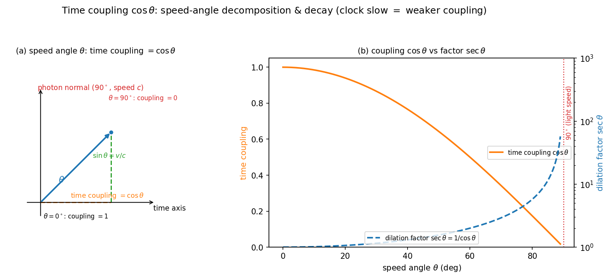
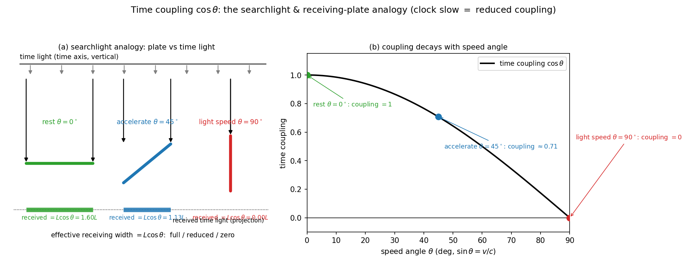

# 怎么理解飞船时钟变慢的作用机理？

> 知乎问答文档（UFPF 视角，基于 Paper XLIV 时间耦合线研究成果）
> 文档状态：与论文同步（paper44 v0.12 / 笔记方向 6 v0.26，2026-08-11）
> 对应研究：`universal_fixed_point_framework/notes/06_photon_topology/photon_first_principle_origin.md` §7.6-7.8、§7.24

---

## 一句话回答

**飞船时钟变慢，本质是飞船的"时间耦合强度"减弱了**——飞船速度越接近光速，它和"时间"的耦合越弱，自身的时间演化就越慢。这不是钟坏了，也不是观测错觉，而是运动物体在时空中的"速度方向"从时间轴转向了光速方向（光速是时间轴的法向参照）时，时间轴投影按余弦规律衰减的几何必然。

**关键不在"钟"，在"时间耦合"**——钟慢只是"时间耦合强度减弱"这一更基本物理量的一个运动学表现。时间耦合是物体与"时间"之间的**作用关系**：它比钟慢更底层——钟慢测的是结果（固有时走慢多少），时间耦合讲的是原因（关系为何减弱）。这个关系由**拓扑类型**决定（光子开放解耦、驻波紧致持续，命题 2.7）：光子是零时间耦合的极限靶点，飞船加速就是向这个靶点逼近——关系不断减弱、但永远到不了零（有质量物体固有时恒正）。所以钟慢的机理核心不是公式 $\gamma=1/\sqrt{1-v^2/c^2}$，而是"速度方向转向光速法向 → 时间轴投影衰减"这个**几何关系**。

**视角说明**（看问题的方向）：教科书路径把钟慢当作洛伦兹变换公式的结论（已知的 γ），本回答则换一个方向——把"时间耦合"当作更基本的量（钟慢只是它的一个运动学表现），并追问它的来源（由拓扑类型决定，命题 2.7）。**方向不同 ≠ 结论不同**：时间耦合 cosθ 与标准 γ 因子数学等价（cosθ=1/γ），本回答是同一物理的另一种组织方式——不修改狭义相对论，也不构成独立于它的推导（诚实边界见 §六）。

---

## 一、现象回顾（为什么需要"机理"）

狭义相对论的钟慢效应：运动飞船上的时钟，相对静止观测者走得慢。定量关系：

$$\Delta\tau=\frac{\Delta t}{\gamma},\qquad \gamma=\frac{1}{\sqrt{1-v^2/c^2}}$$

其中 $\Delta t$ 是地球（静止系）时间，$\Delta\tau$ 是飞船固有时。$v=0.9c$ 时慢 56%，$v=0.99c$ 时慢 86%。

这是实验事实（不是思想实验）：
- **GPS 卫星**：每天因运动慢约 7.2 微秒（狭义部分），必须校正；
- **Hafele–Keating（1971）**：飞机上的铯原子钟真实走慢；
- **μ 子**：高速 μ 子寿命延长 15 倍，足以穿越大气层。

但"为什么"会慢？仅说"相对论效应"不够——用户要的是**作用机理**。

## 二、作用机理的核心：速度角与时间耦合

关键引入一个几何量——**速度角 θ**：

$$\sin\theta=\frac{v}{c}$$

静止物体 θ=0°，光速 θ=90°。**光速是时间轴的法向（垂直）参照**：任何惯性系中光速都是 c（光速锁定），所以"光速方向"可以作为一个不动的 90° 参照轴。

在这个几何下，运动飞船的时间演化强度是：

$$\text{时间耦合强度}=\cos\theta=\sqrt{1-v^2/c^2}=\frac{1}{\gamma}$$

**机理链**：

1. 飞船加速 → 速度方向从时间轴（θ=0°）向光速法向（θ=90°）旋转；
2. 时间耦合 = 速度方向在**时间轴上的投影** = cosθ；
3. θ 增大 → cosθ 减小 → 时间耦合减弱 → 飞船自身时间演化变慢；
4. 光速（θ=90°）时 cosθ=0 → 时间耦合为零（光子传播中时间"冻结"的极限图像）。

**钟慢 = 向光子的时间状态逼近**：光子没有惯性参考系、传播途中时间耦合为零（狭义相对论中光速物体固有时冻结）。飞船加速就是在这个方向上逼近，但永远到不了（$v<c$ 不可达）——所以时间耦合永远大于零、但不断减弱。

## 三、底层逻辑：为什么这个机制成立

### 3.1 光速锁定是前提

光速 c 在任何惯性系中相同（实验确立 + 时空-电磁粘合结构的本征标度）。正因为 c 是"不动"的参照，速度角 θ=arcsin(v/c) 才有定义，光速才能作为 90° 法向。

### 3.2 时间与空间是同一几何的两个方向

在 4 维时空中，静止物体的 4-速度是纯时间方向 (1,0,0,0)；运动物体是旋转后的单位矢量 (γ, γβ, 0, 0)——**加速 = 4-速度从时间轴旋转向空间/光锥方向**。时间耦合 cosθ 就是这个旋转中时间分量的衰减。

### 3.3 光子与时间的正交（UFPF 诠释）

在 UFPF 框架（Paper XLIV）中，光子作为开放行波拓扑，其传播方向与时间正交（推论 2.1 时间解耦）——**光速 = 时间轴的法向**（90° 参照）由此获得拓扑基础。紧致驻波拓扑（原子定态）则与时间持续耦合（相位循环），开放拓扑（光子）时间解耦——**时间耦合模式由拓扑类型决定**（命题 2.7：开放解耦、紧致持续）。

**图 1**（速度角分解与时间耦合衰减，对应 paper44 图 5 的 (a)(b) 面板）：左——(a) 速度角 $\theta$（$\sin\theta=v/c$）分解：时间轴（水平）与光子法向（90°，光速）之间，速度矢量在时间轴上的投影即时间耦合 $=\cos\theta$（$\theta=0^\circ$ 时耦合 $=1$、$\theta=90^\circ$ 时耦合 $=0$）；右——(b) 时间耦合 $\cos\theta$ 随速度角单调衰减（左轴），膨胀因子 $\sec\theta=1/\cos\theta$ 随之增长（右轴，对数）——**钟慢 = 耦合减弱、膨胀因子增大**。性质声明：几何示意/数据图，与标准快度图像等价（$\cosh\eta=\gamma=\sec\theta$），数学上 $\cos\theta=1/\gamma$，不构成新物理预言。脚本：`scripts/paperX_time_coupling_fig5ab_zhihu.py`（原图：`paperX_time_coupling_lorentz_figs.py`）。

## 四、直观图像

### 4.1 斜线 vs 渐近曲线（匀加速飞船）

- **牛顿（无钟慢）**：速度随时间线性增长 $v=at$——速度角 θ 直线增长，会"穿过"90°（超光速，不自洽）；
- **相对论（有钟慢）**：速度 $v=at/\sqrt{1+(at/c)^2}$ 渐近贴近光速——θ 无限逼近 90° 但永不到达。

**钟慢就是那条"永远贴不到 90° 的曲线"**——时间耦合 cosθ 随 θ→90° 而趋于零，但飞船永远保留一部分时间耦合（有质量物体固有时恒正）。

### 4.2 时间轴倾斜（洛伦兹变换图像）

飞船的时空坐标轴相对地球"倾斜"：时间轴倾斜角 arctan(v/c)，光锥（45°）保持不变。钟慢 = 倾斜后的飞船时间轴在地球时间轴上的投影缩短——同一几何，另一表述（洛伦兹变换的时间耦合诠释，paper44）。

**空间分量：尺缩与钟慢同源**——洛伦兹变换不只重标定时间，空间方向同样被重标定：尺缩因子 1/γ=cosθ 与钟慢因子是**同一个 cosθ**。用探照灯类比：不仅你接到的"时间光"变少，你量出的"空间长度"也按同一比例缩短——钟慢与尺缩是同一几何（坐标轴倾斜投影）的两面：一个发生在时间方向、一个发生在空间方向。另一个互补关系：运动物体的"时间偏向"=cosθ、"空间偏向"=sinθ（cos²θ+sin²θ=1）——你越偏向空间，就越偏离时间（注意：这里"空间偏向 sinθ"是运动方向的语言，与上面"尺缩因子 cosθ"（测量投影）是两个口径，互补而非等同）。光子的对偶也由此补全：**光子与时间正交（时间耦合=0）⇔ 光子沿空间传播（空间偏向=1）**——零时间耦合与满空间偏向是同一拓扑事实的两面。

### 4.3 通俗类比：探照灯与"时间接收面"

把"时间"想成一束垂直照下来的探照灯（光束方向 = 时间轴），你是灯光下的一面**接收板**。你能收到多少"时间的步伐"，取决于你**正对光束**的程度——这个"正对程度"就是**时间耦合**。

- **静止（θ=0°）**：接收板正对光束，受光面积最大——时间耦合满格（cosθ=1），时间的每一下走针都完整传给你，内部时钟跟着同步走；
- **加速（θ 增大）**：接收板开始倾斜，光斜斜地照过来，有效受光面积按余弦变小——时间耦合减弱（cosθ 变小），你收到的时间步伐变少——**这就是钟慢**；
- **光速（θ=90°）**：接收板转到与光束平行，光从侧面擦过、有效受光为零——时间耦合归零。光子正是这个状态：对时间"侧身"而驰，传播途中收不到任何时间步伐（时间"冻结"的极限图像）。

**这个类比的关键正是"时间耦合才是关键"**：变慢的不是你的钟、不是你的内部机构，而是你与时间的**接触面积**（耦合强度）在变小——钟只是"时间步伐"的接收者，耦合减弱才是原因。飞船永远无法完全侧过身（v<c 不可达），所以永远保留一部分受光面——时间耦合大于零、固有时恒正。

**图 2**（探照灯与"时间接收面"类比，示意图）：(a) 垂直"时间光"下接收板三种姿态——静止正对光束（受光满幅）、加速倾斜（有效受光按 cosθ 衰减）、光速侧身（受光为零，即光子极限）；(b) 时间耦合 cosθ 随速度角 θ 的单调衰减曲线，三状态点与 (a) 同色对应。性质声明：几何类比示意（非数据图），数学上与 cosθ=1/γ 等价，不构成新物理预言。脚本：`scripts/paperX_searchlight_time_coupling_fig.py`。

## 五、常见误解澄清

| 误解 | 澄清 |
|:--|:--|
| "飞船上的钟坏了/机构慢了" | 不是——飞船内部一切过程（原子振荡、心跳、化学反应）同样变慢，机制是时间本身演化变慢 |
| "只是观测者错觉" | 不是——GPS 校正、μ 子寿命、Hafele–Keating 都是物理事实 |
| "飞船时间真的慢了"（绝对意义） | 钟慢是**相对**的：飞船看地球的钟同样慢（对称性）；绝对时间不存在 |
| "光速是极限所以时间冻结" | 有质量物体到不了光速——时间耦合趋近零但不为零（固有时恒正） |

## 六、诚实边界（重要的学术声明）

1. **数学等价**：时间耦合 cosθ 与标准 $\gamma$ 因子**完全等价**（cosθ = 1/γ）——本回答的机制是**几何诠释**，不是新的数值预言；
2. **诠释归属**："时间耦合"语言来自 UFPF 框架（Paper XLIV 命题 2.7、推论 2.1 时间解耦）——把钟慢的几何来源归结为"速度方向向光子法向旋转的时间轴投影损失"；
3. **前提输入**：诠释依赖光速锁定（c 为 SI 测定值）与洛伦兹几何（γ 因子）——不构成独立于狭义相对论的推导；
4. **数值验证**：时间耦合线的数值自洽性已验证（6/6：γ→∞ 极限收敛、cosθ≡1/γ、boost 三角参数化等价、牛顿斜线 vs 相对论渐近、光速锁定复核，脚本 `paperX_photon_time_coupling.py`）；
5. 本文为科普向机制解读，详细推导见论文与笔记。

---

**参考文献**（项目内）：Paper XLIV 推论 2.1（时间解耦）/ 命题 2.7（时间耦合模式拓扑决定）/ §2.2 洛伦兹变换时间耦合诠释；笔记方向 6 §7.6-7.8、§7.24。标准物理：Einstein 1905（狭义相对论）；Hafele & Keating 1972（钟慢实验）。
