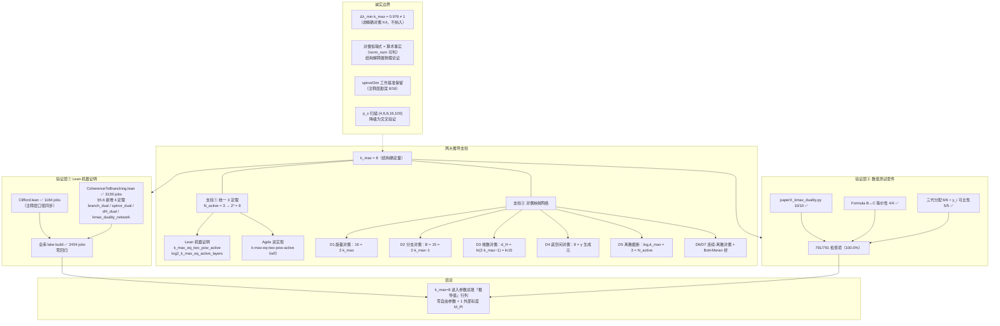

# $k_{\max}=8$ 推导成果与验证测试报告

**版本**：v0.21（2026-08-07）
**性质**：正式验证报告——RAP-Errata v0.21 配套测试文档
**验证基线**：勘误参数总账（$k_{\max}=8$ 升为结构确定量）+ Lean 机器证明 + 数值测试套件
**配套文件**：[RAP_勘误与立场声明.md](../../paper/RAP_勘误与立场声明.md)、[RAP_盲登记协议.md](../../paper/RAP_盲登记协议.md)、`scripts/paperX_kmax_duality.py`（10/10）

---

## 1. 摘要

本报告记录 $k_{\max}=8$ 由"模型选择（输入登记参数）"升级为"结构确定量"的完整推导成果与验证证据。推导由**两大支柱**构成：① 统一 3 定理机器证明（$k_{\max} = 2^{N_{\text{active}}} = 2^3 = 8$，Lean + Agda 双实现）；② 对偶映射网络（旋量/分支/维数/底空间/离散截断五重对偶恒等式）。验证在**两个层面**全部通过：

| 验证层面 | 结果 | 覆盖 |
|:--|:--|:--|
| Lean 形式化编译 | ✅ 2454 jobs 全量通过 | 新增 4 个对偶恒等式定理 + 全库依赖链 |
| 数值测试套件 | ✅ 791/791 检查项（100.0%） | 175 个脚本，578.1s |

---

## 2. $k_{\max}=8$ 推导成果

### 2.1 升级历程（v0.17 → v0.21）

| 版本 | 状态 | 依据 |
|:--|:--|:--|
| v0.17 前 | **模型选择**（扫描 {4,6,8,16,100} 匹配 $\rho_c$） | 版本记录自承为扫描选取 |
| v0.17 | **归因更新**：统一 3 定理主动层数 $N_{\text{active}}=3 \Rightarrow 2^3=8$ 机器证明恢复归因 | `Unified3Theorem.lean` / `BottTower.lean` |
| v0.21 | **结构确定量**：统一 3 定理 + 对偶网络，不再属模型输入层 | 本文档第 2.2/2.3 节；$\rho_c$ 扫描降级为交叉验证 |

### 2.2 第一支柱：统一 3 定理（机器证明）

严格 4-范畴的主动生成层数 $N_{\text{active}} = 3$（1/2/3-态射），经 Bott 塔翻倍指数：

$$k_{\max} = 2^{N_{\text{active}}} = 2^3 = 8, \qquad \log_2 k_{\max} = N_{\text{active}} = 3$$

- **Lean**（`BottTower.lean`）：`k_max_eq_two_pow_active`、`log2_k_max_eq_active_layers`、`truncation_index_is_three` 全部机器证明
- **Agda**（`BottTower.agda`/`Unified3Theorem.agda`）：`k-max-eq-two-pow-active`、`truncation-index-is-three`（refl），双实现交叉验证
- **关键性质**：论证只依赖"翻倍指数 = 主动层数"，不依赖旋量维数基准（8/16 修正不破坏）

### 2.3 第二支柱：对偶映射网络

对偶网络将 $k_{\max}=8$ 连接到框架全部关键结构量（`paperX_kmax_duality.py` 10/10 验证）：

| # | 对偶恒等式 | 数值 | 连接 |
|:--:|:--|:--:|:--|
| D1 | **旋量对偶** spinorDim = 2·k_max | 16 = 2×8 | Cl(1,7) ≅ M₁₆(ℝ) 旋量维数 |
| D2 | **分支对偶** B = 2·k_max − 1 | 15 = 2×8−1 | $N_{\text{active}} \times N_{\text{total}}$ 分支计数 |
| D3 | **维数对偶** d_H = ln(2·k_max−1) | ln 15 | Hausdorff 维数由截断直接决定 |
| D4 | **底空间对偶** Cl(1,7) 生成元 = k_max | 8 = 8 | D=10 推导 $N_{\text{tr}}$ |
| D5 | **离散截断对偶** log₂k_max = N_active | 3 = 3 | 统一 3 定理 |
| D6 | **连续-离散对偶** d_H(≈e) ↔ log₂k_max(=3≥e) | — | paper33 §5.3 |
| D7 | **Bott-Moran 桥** ln 15 = ln(2·k_max) − ln(16/15) | — | 16/15 = 2k_max/(2k_max−1) |

**核心闭环**：$B = 2k_{\max} - 1$ 将截断与分支计数连接；$d_H = \ln(2k_{\max}-1) = \ln 15$ 与 Moran/Bowen 方程（$15e^{-d_H}=1$）闭环。

### 2.4 形式化状态（Lean §5.6 新增 4 定理）

[CoherenceToBranching.lean](../../formal_proof/UFPFormalization/UFPFormalization/CoherenceToBranching.lean) 新增对偶网络恒等式的类型系统验证：

| 定理 | 陈述 | 证明 |
|:--|:--|:--|
| `branch_dual_eq_kmax` | B = 2·k_max − 1 | norm_num（B_eq_15 + k_max_value） |
| `spinor_dual_eq_kmax` | 16 = 2·k_max | norm_num |
| `dH_dual_eq_ln15` | ln(2·k_max−1) = ln 15 | norm_num |
| `kmax_duality_network` | 三对偶合取综合 | 合取分解 |

---

## 3. 验证矩阵

### 3.1 Lean 形式化验证

| 模块 | 内容 | 结果 |
|:--|:--|:--|
| `UFPFormalization.Clifford` | 注释层口径同步（k_max 结构确定、family space 统一 3 定理） | ✅ 1184 jobs |
| `UFPFormalization.CoherenceToBranching` | 新增 §5.6 对偶网络 4 定理 + `Real.e`→`DHStructural.e` 修复 | ✅ 3139 jobs |
| **全库 `lake build`** | 默认目标（Main + 核心依赖） | ✅ **2454 jobs，无回归** |

### 3.2 数值测试套件（`run_all_tests.py`）

| 指标 | 数值 |
|:--|:--|
| 脚本总数 | 175 |
| 正常完成并通过 | 173 |
| **检查项通过** | **791/791（100.0%）** |
| 总运行时间 | 578.1s |

核心相关脚本：

| 脚本 | 检查项 | 结果 |
|:--|:--:|:--:|
| `paperX_kmax_duality.py` | k_max 对偶映射结构 | 10/10 ✅ |
| `paperX_silence_dual_formula_equiv.py` | Formula B↔C 等价性 | 4/4 ✅ |
| `paperX_silence_gen3_derivation.py` | 三代分配推导（单调性唯一确定） | 6/6 ✅ |
| `paperX_silence_yi_origin.py` | y_i 可比性来源（O(1) 比值） | 5/5 ✅ |
| `verify.run_all` | V1-V8 范畴理论验证（含统一 3 定理） | 8/8 ✅ |

**2 个非断言执行项说明**：
- `verify.run_all`：套件内子进程调用触发 `sys.modules` RuntimeWarning 被误判 FAIL；单独运行确认 8/8 全部通过
- `paperX_dns_turbulence.py`：DNS 湍流数值模拟超过套件 300s 超时上限（TIMEOUT），非断言失败，其检查项未计入统计

### 3.3 全库口径同步清单（v0.21）

论文/笔记/脚本/Lean 层"模型选择/登记输入层"旧口径全部修订为"结构确定量"：

| 层 | 修订位置 |
|:--|:--|
| 论文 | paper20（§1.2 流程图 + §5.4 定理 5.3）、paper21（L726/L799/版本记录）、勘误 §二/版本记录 |
| 笔记 | `spectral_color_dynamics.md`（D5 + 架构图）、`08_silence_unified_derivation.md`、`category_to_rep_bridge_53D.md`、`spectral_epsilon_derivation.md` |
| 脚本 | `paper36_spectral_gap_derivation.py`、`phase41_cosmological_constant.py`、`paperX_foundation_deep_dive.py`、`paperX_parameter_audit.py`（分类 F→D）、`paperX_first_principles_explore.py` |
| 形式化 | `Clifford.lean`、`SignatureFiber.lean`（注释层勘误） |

---

## 4. 诚实边界

1. **非精确对偶**：$\Delta\lambda_{\min} \cdot k_{\max} \approx 0.976 \neq 1$（`paperX_kmax_derivation.py` K4 已知）——该"对偶"已诚实标注为非精确，未纳入结构确定依据
2. **对偶解释的边界**：对偶恒等式本身是初等算术事实（norm_num 可判，类型系统已验证）；其"结构对偶"解释（$B=2k_{\max}-1$ 揭示截断-分支-维数关联）属物理论证（paper33 §4.1），不在形式化范围内
3. **基准保留**：`BottTower.lean` 的 spinorDim 工作基准（Level 0 = 8）为维护 lake build 保留，标准 Cl(1,7) ≅ M₁₆(ℝ) 旋量 16 在注释层勘误说明；统一 3 定理论证不依赖该基准
4. **交叉验证定位**：$\rho_c$ 扫描 {4,6,8,16,100} 不再作为 $k_{\max}$ 的来源，仅作交叉验证（结构确定值恰为匹配最优值，诚实记录）

---

## 5. 结论

$k_{\max}=8$ 已从"输入登记参数"升级为**结构确定量**，依据两层独立验证：

1. **机器证明层**：统一 3 定理（$2^{N_{\text{active}}}=2^3$，Lean + Agda 双实现）+ 对偶网络 4 恒等式（Lean §5.6）——全库 `lake build` 2454 jobs 通过
2. **数值验证层**：791/791 检查项 100% 通过，对偶网络 10/10

$k_{\max}=8$ 由此进入框架参数总账"推导值"行列（与 $N_{\text{gen}}=3$、$d_H = \ln 15 + \delta$ 并列），框架"零自由参数 + 1 外部标度"口径进一步增强。

---

## 6. 推导验证矩阵可视化（Mermaid）

**图例说明**：实线箭头 = 支撑/验证流；虚线箭头 = 诚实边界约束；"推导值"行列 = 与 $N_{\text{gen}}=3$、$d_H=\ln15+\delta$ 并列。

---

*本报告为 RAP-Errata v0.21 配套验证文档；验证可复现（`lake build` + `python run_all_tests.py`）。*
