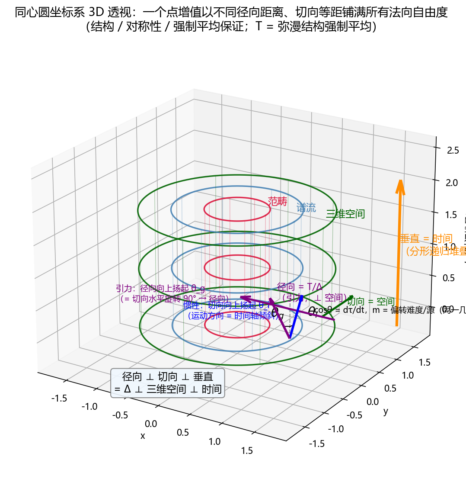

# 直觉登记：质量是偏转时间轴的难度（谱间隙 × 时间耦合的动力学重述）

**状态**：🟡 直觉/诠释笔记 v0.16（2026-08-14；v0.1 登记直觉与精确形式；v0.2 新增"范畴层延伸"与"主观=观测时间"澄清；v0.3 新增"引力侧在谱流中的表达"；v0.4 新增 §5.1"等价性证明"（paper18 §11 谱交织条件）；v0.5 新增 §7"图像登记"（同心圆坐标系；T 藏在径向；弥漫性包覆）；v0.6 §7 补充"两种质量 = 同一几何图像"；v0.7 §7 收敛"核心纲领"；v0.8 补 §7.1"本体论基础"与 §7.2"可证伪性分层判定"；v0.9 补 §7.3"闭合路径评估"；v0.10 补"旋转 90° 精确化"与 §7.2"谱交织旋转检验"实例化候选；v0.11 §9-11 同步修订；v0.12 补 §7.4"处处相容的含义"；v0.13 补 §7.5"谱交织旋转检验：完整推理链"；v0.14 §7.5 更正补"同命运判定"（谱交织不存在 = 测到差异 = 同时证伪标准理论等效原理）；v0.15 整理去矛盾（§7.2/§7.5 检验逻辑与同命运判定合并去重、§7.4 前提标注外推、§7.2 判定句补注）；v0.16 修正 v0.15 的路径误判——图/脚本相对路径统一为 ../../（笔记于 notes/04_lorentz_gravity/，上两级至 universal_fixed_point_framework 再进 figs/、scripts/），误改的 ../ 已改回——王斌基于 paper44 §5.3 双法向偏转统一提出的直觉：质量 = 偏转时间轴的难度；本笔记将其精确化并与框架内已有结构（paper44 时间耦合图像、paper16 质量=谱间隙、paper18 谱牛顿、paper31/35 引力起源、等效原理）挂钩）
**关联**：paper44《光子生成的拓扑转变机制》§2.2（时间耦合 = cosθ、图 5）与 §5.3（双法向偏转统一）；paper16《Lorentz 变换的谱动力学解读》定理 6.3（静质量 = 谱间隙）；融合路线 `roadmap/u2f_fusion_roadmap.md` 路径③（世界线/固有时）
**性质**：框架内诠释重述登记，非新物理预言

---

## 1. 直觉陈述

> **质量是偏转时间轴的难度。**

即有质量物体偏离"完全时间耦合"状态（时间轴方向不变）需要付出能量代价，质量是该代价的系数；光子（零质量）以零代价处在完全解耦位置。

## 2. 精确形式

paper44 §2.2 图 5 的语言：时间耦合 = cosθ，膨胀因子 = secθ，θ 为时间轴偏转角（速度角）。相对论动能在该语言下为

$$E_{\rm kin} = (\gamma-1)mc^2 = (\sec\theta - 1)\,mc^2.$$

- $\theta = 0$：时间轴完全耦合（静止），代价 0；
- $\theta \to 90°$：时间耦合 $\to 0$（解耦极限），代价 $\to \infty$；
- **m 固定时**：θ 越大的代价越高；**θ 固定时**：m 越大代价越高。

因此直觉的精确表述是：**质量 m 是把时间轴偏转到角度 θ 的能量代价系数**（"难度"指动力学代价，非运动学偏转量本身）。

## 3. 框架内三重对应

| 直觉成分 | 框架内对应 | 出处 |
|:--|:--|:--|
| 偏转时间轴 = 改变世界线方向 | 时间耦合 cosθ 随 θ 减小；光子 ⊥ 时间（θ=90° 零耦合极限） | paper44 推论 2.1 |
| 难度 = 能量代价 | (secθ−1)·m 是 θ 的代价函数，m 为系数 | paper44 §2.2（图 5） |
| 质量本身 = 什么 | 谱间隙：$m^2 = \min\sigma(M^2) = \Delta\lambda_M$ | paper16 定理 6.3 |

第三行的连接构成谱语言读法：

> **质量 = 谱间隙 = 让系统从"时间轴完全耦合"状态偏转离开的最小能量门槛。**光子（$\Delta\lambda_M = 0$，位于 $\partial\mathbf{Rec}_D$）偏转代价为零——这是它无法慢下来（无法被"费劲偏转"）的谱侧原因。

## 4. 推论：难度 = 源 ⟺ 等效原理的谱语言

paper44 §5.3 已统一"质量改变时间流逝"（引力：向 $\Delta$ 方向偏转，$\cos\theta_{\rm esc}=\sqrt{1-2GM/rc^2}$）与"运动改变时间流逝"（SR：向时间轴法向偏转）。本直觉将其翻转为一个双重角色陈述：

- **惯性侧**：m = 时间轴偏转的**难度系数**（$E = (\sec\theta-1)mc^2$）；
- **引力侧**：m = 时间轴偏转的**源**（$\theta_{\rm esc}$ 随 M 增大）。

同一个 m 同时是"难度"与"源"——即**等效原理**：质量同时决定它自己被偏转的难易（惯性质量）与它偏转他人时间轴的强度（引力质量）。这给 §5.3 统一命题一个动力学层的落点，并把等价原理表述为"时间轴偏转的难度 = 时间轴偏转的源"。

## 5. 引力侧在谱流中的表达：质量 = 局域谱缺陷 + rapidity 场空间分布

**源（paper35 §5.2 环①，机器证明）**：点质量对应谱算子的局域扰动

$$A \to A + \delta\lambda\cdot P_0$$

（$\delta\lambda$ = 局域谱间隙移动，$P_0$ = 锚定在位置 $r$ 的投影；质量作为源 = $A$ 的静态缺陷项）。代入交换律偏差 $\Delta$ 的多线性形式：$\delta\Delta = \delta\lambda\cdot(\cdots)$ **严格线性**——`source_defect_linearity`（DeviationBound.lean §1.6）机器证明，Newton 引力的质量线性是**代数事实**而非近似。

**场（谱流语言）**：谱流方程 $dA/d\tau = [G, A]$ 在局部惯性系逐点成立；全局看，质量缺陷把谱流内禀时间（rapidity）扭曲成空间分布：

$$\cosh\varphi_{\rm grav}(r) = 1/\cos\theta_{\rm esc} = 1/\sqrt{1-2GM/rc^2},$$

引力时间膨胀 = rapidity 场的立场分布（$\varphi_{\rm grav}(r)$ 的梯度即引力"力"）。

**强度**：$G_N = 18(2+\sqrt{3})\cdot(\Delta\lambda_{\min})^2/M_{\rm Pl}^2$（paper35 定理 2.1）——引力强度由**全局**谱间隙决定，与局域源大小（$\delta\lambda$）分离。

**等效原理的完整谱语言**：同一个谱间隙双重角色——惯性侧是"自己偏转时间轴的代价系数"（§4），引力侧是"扭曲他人 rapidity 场（时间轴方向场）的源"（本节）。惯性 = 谱间隙抵抗你改变自己的时间轴；引力 = 谱间隙改变他人的时间轴方向场，按 $\delta\lambda$ 线性累积。

**注意**：区分**全局谱间隙**（$\Delta\lambda_{\min}$，决定 $G_N$，结构常数）与**局域谱移动**（$\delta\lambda$，决定源大小，缺陷）——两者分离是 paper35 的前提，混淆会导致"质量 = 引力常数"的错误。

### 5.1 等价性证明：惯性侧 = 引力侧（paper18 §11 定理 11.1）

两侧各自的谱流机制均可证：

- **惯性侧**：$m^2 = \min\sigma(M^2) = \Delta\lambda_M$，$M^2$ 是谱流不动点（paper16 定理 6.3 / 注 6.5）；Lorentz 谱流 $dA/d\varphi = [K, A]$ 保谱；偏转代价 $E = (\cosh\varphi-1)m$，$m = \hbar/\Delta\lambda_{\min}$（paper18 定义 2.1，热力学极限下等于经典质量——定理 2.2）；paper18 命题 2.1 即"惯性 = 抵抗离开 $\mathbf{Rec}_D$ 的代价"。
- **引力侧**：质量 = 局域缺陷 $A \to A + \delta\lambda\cdot P_0$，$m = \delta\lambda\cdot M_{\rm Pl}$（paper31 §5.2，与谱惯性自洽）；$\delta\Delta = \delta\lambda\cdot\mathrm{lin}(\Delta)$ **严格线性**（paper31 定理 J1，机器证明）。

**桥（谱交织条件取迹）**：

$$A_{\rm GR}\cdot T = T\cdot A_{\rm SM} \ \Rightarrow\ \mathrm{Tr}(T^\dagger A_{\rm GR} T) = \mathrm{Tr}(A_{\rm SM})$$

即 $m_{\rm gravitational} = \mathrm{Tr}(T^\dagger A_{\rm GR} T) = m_{\rm inertial}$（定义 11.1：$m_{\rm inertial} = \hbar/\Delta\lambda_{\min}$；定义 11.2：$m_{\rm gravitational} = \mathrm{Tr}(T^\dagger A_{\rm GR} T)$；比例系数 1 由量纲归一化）。命题 11.1：等价是谱交织条件的必然结果，非偶然。

**结论**："偏转自己时间轴的代价系数 = 扭曲他人 rapidity 场的源"不是新定理，而是定理 11.1 的动力学诠释——**同一谱间隙（$\hbar/\Delta\lambda_{\min}$）在自身上是偏转代价，在他人身上是扭曲源**。

**三个前提（诚实）**：① 等价证明是**条件式**的，依赖谱交织条件 $A_{\rm GR}\cdot T = T\cdot A_{\rm SM}$（框架结构，非谱流推论——谱流提供两侧各自机制，不提供桥）；② 缺陷模型（质量 = 谱缺陷）是建模指派（paper31 诚实标注，自洽 ≠ 推导）；③ 双"谱间隙"记号缺口——paper18 的 $\Delta\lambda_{\min}$（特征值最小间隔）与 paper16 的 $\Delta\lambda_M$（$\min\sigma(M^2)$）是两个量，其桥接未见显式统一，是严格化该等价前需补的一环。

## 6. 范畴层延伸：偏转时间轴 = 沿 rapidity 谱流移动；质量 = 谱流不动点

时间在 UFPF 中是分层的（递归层计数 → 谱层谱流参数 → 物理层观测时间）。"偏转时间轴"在谱层的对应是 boost 的 rapidity 参数 $\varphi$，与物理层偏转角 $\theta$ 同构：

$$\cosh\varphi = \sec\theta = \gamma.$$

- "在时间中移动" = 沿 rapidity（谱流内禀时间）方向演化（paper16 §3，$\varphi$ 可加）；
- 物理层的"改变时间轴"（$\theta$）⟷ 谱层的"沿 rapidity 谱流移动"（$\varphi$）——**同一谱流的两种表述**。

**质量在范畴层的位置**：$M^2$ 是 Lorentz 谱流的**不动点**，$M^2 \in \mathrm{Fix}(\mathbf{Sp}^{SO^+(1,3)})$（paper16 注 6.5，$[G, M^2]=0$）。因此：

> **质量 = 谱流（时间方向改变）的不动点 + 该移动的代价系数。**沿 rapidity 谱流移动越远（$\varphi$ 越大），代价 $(\cosh\varphi - 1)mc^2$ 指数增长；$m$ 标定每次移动的"重量"，且 $m^2 = \Delta\lambda_M$（谱间隙）。光子 $\Delta\lambda_M=0$ 在 $\partial\mathbf{Rec}_D$ 上是谱流下的平凡不动点，移动零代价——"永远停不下来"。

"时间从任意点充满空间"对应每个时空点的类时方向场；光子 ⊥ 时间（paper44 推论 2.1，$\theta=90°$）是"在时间方向场中移动"的零耦合极限，有质量粒子是 $\theta < 90°$ 的不彻底解耦——**质量量化了"不彻底解耦"的程度**。

## 7. 图像登记：同心圆坐标系与弥漫包覆修正

**同心圆图像（理想化）**：范畴（内圈）→ 谱流（中圈）→ 三维空间（外圈）由内到外同心圆；垂直向上 = 时间（分形递归堆叠 + rapidity 内禀时间）；"范畴向外水平径向中心结构性收缩" = 空间感受到指向范畴的引力。

**框架内映射**：

| 图像方向 | 数学内容 | 框架对应 |
|:--|:--|:--|
| 径向（层间） | T-共轭、Δ 偏差 | 引力方向（⊥ 空间，paper35 §3.2） |
| 切向 | 空间方向 | 三维空间（纤维丛基空间） |
| 垂直（堆叠） | rapidity 谱流、递归计数 | 时间方向（paper16 §3） |

**关键修正（T 藏在径向）**：谱交织条件 $A_{\rm GR}\cdot T = T\cdot A_{\rm SM}$ 在 T 可逆时等价于 $A_{\rm GR} = T\,A_{\rm SM}\,T^{-1}$——**T-共轭**。图像中"层间变换"正是 T：外圈 = 内圈经 T 的共轭像，"径向结构性收缩" = T 把空间层编织回范畴层。因此图像**不缺失 T**，而是把 T 画成了径向结构——此时图像与定理 11.1 的证明一一对应（faithful），"两个偏转是同一个质量"在图像里 = "两个圈层经 T 互变"。

**三层正交**：径向 ⊥ 切向 ⊥ 垂直 = paper44 双层正交（Δ ⊥ 三维空间）+ paper16 时间 ⊥ 空间。

**两种质量 = 同一几何图像**：垂直方向（时间方向场）的倾斜是唯一的几何对象——惯性侧是"自己这个点的时间方向倾斜 θ，代价 E = (coshφ−1)m"（m 为难度系数），引力侧是"中心源让周围每个点的时间方向倾斜 φ_grav(r)"（m 为源强度）。**同一个倾斜，从自身看是惯性，从他人看是引力**——惯性质量与引力质量画的是同一个几何：时间方向相对垂直轴的倾斜。这是定理 11.1（m_inertial = m_gravitational）的图像版：同一几何量的双重读法，即等效原理。

**旋转 90° 精确化（2026-08-14）**：惯性偏转发生在**切向×垂直**平面（θ_i，运动方向扬起），引力偏转发生在**径向×垂直**平面（θ_g = 切向水平旋转 90°），两者共享公共垂直时间轴——**同一时间轴倾斜，仅水平方向相差 90°**（paper44 §5.3 双法向偏转统一的几何版）。cosθ = dτ/dt 与水平方向无关，m 是偏转难度/源（唯一几何量）。三维透视图像：

（生成脚本 `../../scripts/paperX_mass_deflection_figs_3d.py`；另二维三联动图 `../../figs/mass_deflection_figs.png`，脚本 `../../scripts/paperX_mass_deflection_figs.py`。**路径注记（2026-08-14）**：笔记位于 `notes/04_lorentz_gravity/`，图/脚本相对路径需上两级至 `universal_fixed_point_framework/` 再进 `figs/`、`scripts/`，故统一用 `../../`；v0.15 曾误判 `../../` 指向不存在目录而改为 `../`，经核查改回（v0.16））。

**弥漫性包覆修正（2026-08-14 补充）**：同心圆是**最简理想化**（离散圆环壳便于可视化）；实际结构更可能是**弥漫性包覆**——各层不是刚性分离的圆壳，而是连续分布、互相包裹渗透的场/纤维结构。框架内对应：Grothendieck 谱纤维丛（paper44 §5.4）的连续纤维化——层间是连续纤维包覆而非离散壳；这与 Δ 作为结构常数（非场）的性质相容（paper35 §2.3：Δ 不随时空点变化）。

**核心纲领（2026-08-14 收敛）**：

> **一个点逐渐增值的过程，是以不同径向的距离、切向等距地铺满所有法向自由度——其保证来自结构、对称性、强制平均。**

- **结构**：弥漫性包覆（层间连续渗透、无刚性界面）——同心圆为理想化近似；
- **对称性**：正交结构（O(n)）⟹ 保结构平均必须等变，等变平均唯一（Karcher/Riemannian），自然保正交；
- **强制平均**：谱定理给出唯一谱测度，宏观量 = 谱测度积分——T 的存在、形式、正交性全部由结构决定，零外部输入；
- **推论**：T = 弥漫层间结构的谱测度强制平均；谱交织条件 $A_{\rm GR}\cdot T = T\cdot A_{\rm SM}$ 为宏观层涌现等式；弱等效原理 = 弥漫结构的统计必然（与热力学同级的涌现地位）。

框架内逐项对应：

| 纲领成分 | 框架对应 |
|:--|:--|
| 不同径向距离（层间） | 分层结构（静默 $S_k = s^{n_k}$ 层指数 $n_k$ 各异；或球壳 $r_k$ 可变） |
| 切向等距（层内） | 每层内各向同性覆盖（O(n) 传递作用 / 球面等距） |
| 铺满法向自由度 | V⊥H、⊥Δ、⊥时间 三层法向（paper44 双层正交 + paper16 时间） |
| 结构/对称性/强制平均 | 弥漫包覆 + O(n) 等变唯一平均 + 谱测度（谱定理） |

状态：**CONJECTURE 级纲领**，三项形式化待证——(i) 弥漫结构的对称群/谱测度显式写出；(ii) 等变平均（Karcher/谱测度积分）保正交；(iii) 该平均满足有效谱交织等式。方向坚实：把 T 从"给定结构"翻转为"结构涌现"，弱等效原理获得与热力学同级的统计必然性。

### 7.1 本体论基础（2026-08-14 补充）

三条陈述闭合为纲领的哲学底座：

1. **实在 = 范畴**（UFPF 立场——融合路线 §2"第九条路径"的本体论赌注）；
2. **范畴 = 关系**：Yoneda 引理——对象 X ≅ Hom(X,−) 的表示，对象完全由它与其他对象的关系（态射）决定，**关系优先、实体为关系的结点**；平行支撑：数学结构主义、无点拓扑（开集格描述空间）、过程哲学；
3. **关系从一点增值**：初始对象/生成元/自由构造/归纳原理；最强例子 von Neumann 序数（从空集增值出整个集合宇宙，累积层级 V）；UFPF 内 = 递归不动点（Rec）+ 谱化函子 D。

**闭环**：实在=范畴 ⟹ 范畴=关系 ⟹ 关系从一点增值（初始对象的 Hom 网 = 全范畴）⟹ 核心纲领的"点增值铺满法向自由度" = **初始对象关系谱（Hom 网）的增值铺满**——增值不是单个实体的扩张，而是关系网的生成。

### 7.2 可证伪性分层判定（2026-08-14）

| 层 | 内容 | 可证伪性 |
|:--|:--|:--|
| 哲学层 | "实在 = 范畴"、"关系 = 存在的最简描述" | ❌ 不可证伪——框架选择，无可观测后果，**不计入检测力**（表述层） |
| 数学层 | Yoneda、归纳构造、从一点增值 | ❌ 数学真，非物理预言——框架内部一致性 |
| 物理层 | 增值的几何/动力学形态（等距铺满、径向分层、法向自由度） | ⚠️ 可证伪候选——须实例化为可观测预言 |

**实例化出口**：光子展开（paper44 Φ，P1–P6 已盲登记，远期）；静默分层 S_k = s^{n_k}（层指数 n_k 已锚定：3/4.207/2π/α）；T = 弥漫结构强制平均（未实例化，CONJECTURE）；**谱交织旋转检验（2026-08-14 新增实例化候选，详见下）**。

**谱交织旋转检验（2026-08-14）**：以旋转角 φ 为分配控制参数的等效原理检验。几何基础（§7 旋转 90° 精确化）：惯性 = 切向扬起 θ_i、引力 = 径向扬起 θ_g（水平旋转 90°）；总偏转正交分解

$$\theta^2(\varphi) = \theta_i^2\cos^2\varphi + \theta_g^2\sin^2\varphi, \qquad \frac{d\tau}{dt} = \frac{1}{\sqrt{1 + \theta^2(\varphi)}}.$$

- **交织存在**（m_i = m_g ⟹ θ_i = θ_g）：cos²φ+sin²φ=1 恒等式消去旋转角依赖 ⟹ **无差异**（等效原理预言）；
- **交织不存在**（θ_i ≠ θ_g）：**相对钟差 Δτ(φ) ∝ (θ_g²−θ_i²)·sin²φ**——sin²φ 曲线签名，旋转 90°（纯引力）差异最大、0°（纯惯性）为零。

**逻辑（完整推理链与同命运判定见 §7.5）**：精密测量（光钟）不同旋转角下的钟差——测到 sin²φ 差异 = 质量不等价 = 谱交织与标准理论等效原理**同被证伪**（公共判据）；测不到 → 两者**同相容**（不违反谱交织，不单独证明）。**缺口**：差异量级受 Eötvös 参数约束（η < ~1e-15），需光钟精度 + 差异幅度的量级估计（θ_g²−θ_i² 的 UFPF 预测值）；当前仅有几何导出的函数形式，无数值预测。

**判定**：纲领自身是**坐标系**而非预言——坐标系不需证伪，坐标点（预言）才需证伪。要获得检测力，须在具体系统给出**独立于 P1–P6 的新预言**（谱交织旋转检验即该路径的候选，见 §7.5）；否则纲领止步表述层（诚实登记，不虚增）。

### 7.3 闭合路径评估（2026-08-14）

纲领承诺闭合的（前提涌现化）：

- **① 谱交织条件**（定理 11.1 前提）：T = 弥漫结构强制平均 ⟹ 从"给定结构"变"结构涌现"；
- **② 缺陷模型来源**（质量 = 谱缺陷，§5.1 三前提之②）：**径向分布不均 = 缺陷来源候选**——分层结构的层间径向距离不均（r_k 各异，即纲领"以不同径向距离"）在 r_k 不连续/不均匀处产生局域谱缺陷 δλ·P₀ ⟹ 质量 = 分层非均匀的涌现。物理先例：ADM 质量 = 曲率亏欠、Wheeler"物质 = 时空弯曲"、位错/拓扑缺陷（缺陷 = 结构非均匀）。

**关键约束（防陷阱）**：径向不均**不能是 Δ 的分布不均**——paper35 §2.3 定位 Δ 为结构常数（‖Δ‖_F 全局属性、不随时空点变化、r_cat 标度不变已检验）；不均必须发生在纤维/层结构（层间距跳变、弥漫包覆密度梯度、谱纤维缠绕数变化），不在 coherence 层。

**形式化要求（"不均 → 缺陷"三步）**：① 定义"不均"的量（层间距跳变 Δr_k / 密度梯度 / 缠绕数变化）；② 映射 δλ = f(不均量) 进入 A → A + δλ·P₀；③ 验证与 Δ 结构常数地位相容。

**不自动闭合的**：三项形式化待证（对称群/谱测度显式、等变平均保正交、有效谱交织等式）；T-共轭关系（A_GR = T·A_SM·T⁻¹）的结构保证（新增环节——若分层自相似则可能自动，须证明）；双谱间隙记号桥接（§5.1 三前提之③，与纲领无直接关系）。

**判断**：**闭合候选，非闭合完成**——①+② 若坐实，弱等效原理的两大前提全部从"指派"转"结构涌现"；目前 CONJECTURE 级，缝合线已找到、针未穿完。

### 7.4 处处相容的含义（2026-08-14）

**前提（外推，见 §7.5）**：谱交织旋转检验若测不到差异，且结合边界内其他一致实例（paper44 §5.3 统一 SR/GR、paper35 G_N、静默层锚定），UFPF 在标准理论使用边界内处处相容——"单点 → 处处"为归纳外推，非演绎证明。这意味着四层：

- **结构层**：标准理论 = UFPF 的**边界内有效极限**——UFPF 范畴结构在标准物理领域退化到标准理论，边界外保持自身结构（类比：牛顿力学 = 相对论的低能极限）；
- **检测层**：边界内每个有锚格（✅）= 表述层（零检测力）；UFPF 唯一存续空间 = 标准理论边界上/外（❌ 缺口格、新预言格：P1–P6、静默层、旋转检验）；"处处相容"划出 UFPF 的合法地盘；
- **价值层**：相容是**资格条件**而非价值——处处相容 + 边界外独有预言 = 扩展框架（有价值）；处处相容 + 边界外无新内容 = **处处冗余**（同义反复陷阱，一梦老师警告）；价值完全取决于边界外是否有标准理论给不出的预言；
- **方向层**：处处相容 + 边界内已统一 SR/GR（paper44 §5.3）+ 推导 G_N（paper35）+ 静默层锚定 ⟹ UFPF 是标准理论的**更底层表述**（标准理论为其极限），而非并列理论——若并列，处处相容会极可疑（两个独立理论在所有已测领域无差异概率极低）；若极限，处处相容是必然。

**一句话**：UFPF 把标准理论当作自己的边界内有效极限——相容是资格证明（不冲突），边界外新预言是存在理由（有检测力），缺一不可；只有相容而没有边界外预言 ⟹ 冗余。

**诚实边界**：本图像为启发式登记——三层正交映射有框架依据（paper44/paper16/paper35）；"弥漫包覆 = 谱纤维丛"为类比对应（未形式化）；图像不构成证明——桥由数学结构（谱交织条件）保证，图像使其可见。

### 7.5 谱交织旋转检验：完整推理链（2026-08-14）

**原始直觉**：谱交织可实验验证——旋转不同角度，惯性/引力的分配不同；精密测量时间流逝差异，找到差异则谱交织不成立，无差异则成立。

**方向修正（讨论中确立，纠正了初版相反方向的误读）**：

| | 惯性质量 = 引力质量？ | 不同分配（旋转角）的时间流逝 |
|:--|:--|:--|
| 谱交织存在（A_GR·T = T·A_SM） | 等价（m_i = m_g） | **无差异**（等效原理预言） |
| 谱交织不存在 | 不等价（m_i ≠ m_g） | **有差异**（时间流逝依赖分配） |

**差异函数的几何推导（"几何关系形成的函数"）**：正交叠加建模（惯性/引力偏转正交叠加）→ 总偏转 θ²(φ) = θ_i²cos²φ + θ_g²sin²φ → dτ/dt = 1/√(1+θ²(φ)) → **cos²φ+sin²φ=1 恒等式**：θ_i=θ_g（交织存在）时消去旋转角依赖（无差异）；θ_i≠θ_g（无交织）时留下 Δτ ∝ (θ_g²−θ_i²)sin²φ 签名。

**检验逻辑与同命运判定（2026-08-14，含更正）**：在本检验模型中，谱交织存在性 ⟺ m_i = m_g（模型等价：交织存在 ⟺ θ_i = θ_g ⟺ 无差异；交织不存在 ⟺ θ_i ≠ θ_g ⟹ 测到差异）。因此：

- **测到差异** = 谱交织不存在 = m_i ≠ m_g = **同时证伪标准理论的等效原理**——差异是公共判据，m_i ≠ m_g 同时违反两者，**同证伪**；
- **测不到差异** → **不违反**谱交织（无差异是两者的共同预言），与标准理论相容（证明基于范畴的理论结构在此与标准理论不冲突），**同相容**，但不单独证明谱交织独有。

旋转检验**不区分**谱交织与标准理论（同判据、同命运），检验的是 m_i = m_g 本身，非 UFPF 特有内容。早期分析曾引入"谱交织缺席但 m_i 仍 = m_g（由其他机制保持）"的一般情形——该情形超出本检验模型（此处"谱交织"即 m_i = m_g 的保证机制），与对照表矛盾，已更正。

**从单点相容到处处相容（外推）**：单个旋转检验的无差异 ⟹ 该点相容；"处处相容"是全称断言，需结构性推广——UFPF 在边界内已统一 SR/GR（paper44 §5.3）、推导 G_N（paper35）、静默层锚定，这些"边界内与标准理论一致"的实例共同支持全称外推（归纳强度由边界内实例数决定，非演绎证明）。

**诚实边界**：正交叠加为建模假设（几何导出 ≠ 推导证明）；"单点 → 处处"是归纳外推非演绎；无数值预测（θ_g²−θ_i² 未定，受 Eötvös 约束 η < ~1e-15）。

## 8. 澄清：主观时间 = 观测时间

"主观上看到的时间"即**观测时间**（实验室时钟读数），非哲学意义上的主观体验。框架内对应（paper16 定理 4.1）：观测时间不是内禀谱流参数本身，而是谱算子频率与实验室时钟的比值

$$\omega_{\rm lab} = \omega_0\,\mathrm{sech}\,\varphi = \omega_0/\gamma.$$

物理时间 = 谱层内禀流（rapidity）被递归层时钟（步数累积）**读出**的宏观量——"宏观平均/涌现"在此有精确机制（观测 = 读出），但完整的粗粒化链（递归层计数 → 谱层参数 → 观测时间）尚未形式化，登记为开放问题，不硬推。

## 9. 与检测矩阵的关系

- **归属**：纲领/诠释内容 → 路径③（世界线/固有时）× 动力学列（亦可挂路径④ × 动力学列，经 m² = Δλ_M）；谱交织旋转检验 → 路径③/④ × 量子接口列（可证伪候选）。
- **等级（分层，随 v0.10 更新）**：
  - 纲领与诠释（质量 = 偏转难度、旋转 90°、同心圆坐标系、T 弥漫平均）：**表述层诠释**——与主流结论无可观测分歧，不计入检测力，不构成缺口登记；
  - **谱交织旋转检验：可证伪候选**——写得出分歧实验（sin²φ 钟差签名）；若给出 θ_g²−θ_i² 数值预言则升级为物理层可登记预言（盲登记）。
- **有锚性**：表述层内容均可由已检验路径独立到达（SR 运动学、GR 引力红移），属 ✅/⚠️ 格；旋转检验属"新预言候选"（无数值时按 ⚠️ 待定）。

## 10. 诚实边界

1. 数学内容全部为已知物理的**重新参数化**：(secθ−1)mc² = (γ−1)mc²（标准动能）；dτ/dt = cosθ_esc（GR 已知结果）。不构成新预言，不触发盲登记。
2. **运动学注意**：纯 SR 中偏转角 θ 只由 v/c 决定、与 m 无关；"质量是难度"指**动力学能量代价**，不是"质量越大偏转角越小"。二者须区分。
3. 推论"难度=源"为诠释性统一（等效原理的谱语言），非新动力学内容；其严格形式化（若推进）应落在 paper44 §5.3 诚实边界（仅时间流逝速率层面严格成立）之内。
4. 本笔记为直觉登记，未做数值脚本（无新数值量）。
5. **谱交织旋转检验的差异函数 θ²(φ) = θ_i²cos²φ + θ_g²sin²φ 基于正交叠加建模假设**（惯性/引力偏转正交叠加），属几何导出，非框架定理推导——几何一致 ≠ 推导证明。
6. 该检验目前**无数值预测**（θ_g²−θ_i² 未定），差异量级受 Eötvös 参数约束（η < ~1e-15），实验可行性未评估。
7. 测不到差异**不违反**谱交织（相容）——无差异是谱交织与标准理论的**共同预言**，证明基于范畴的理论结构在此与标准理论相容（不冲突）；但不足以单独证明谱交织独有（标准理论同样预言无差异）。

## 11. 下一步（候选）

- 若推进：将"质量 = 时间轴偏转能量代价系数"作为 paper44 §5.3 的动力学补充注记写入论文（须按论文提炼流程，先由本笔记成熟）；
- 挂接融合路线路径③ 的融合点登记（光子 ⊥ 时间 ⟷ 零代价偏转），作为表述层内容补充；
- **谱交织旋转检验推进（新增候选路径）**：估计 θ_g²−θ_i² 的量级 → 给出 Δτ(φ) 数值预言 → 盲登记 + 入检测矩阵（条款 2/3 对表）——这是"独立于 P1–P6 的新预言"的候选路径（回应 §7.2 判定）；
- 其余无新预言，无盲登记需求（当前）。
