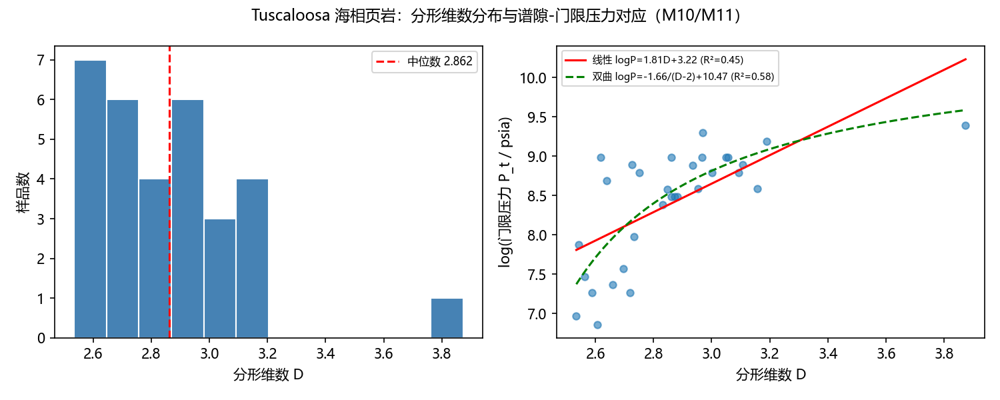
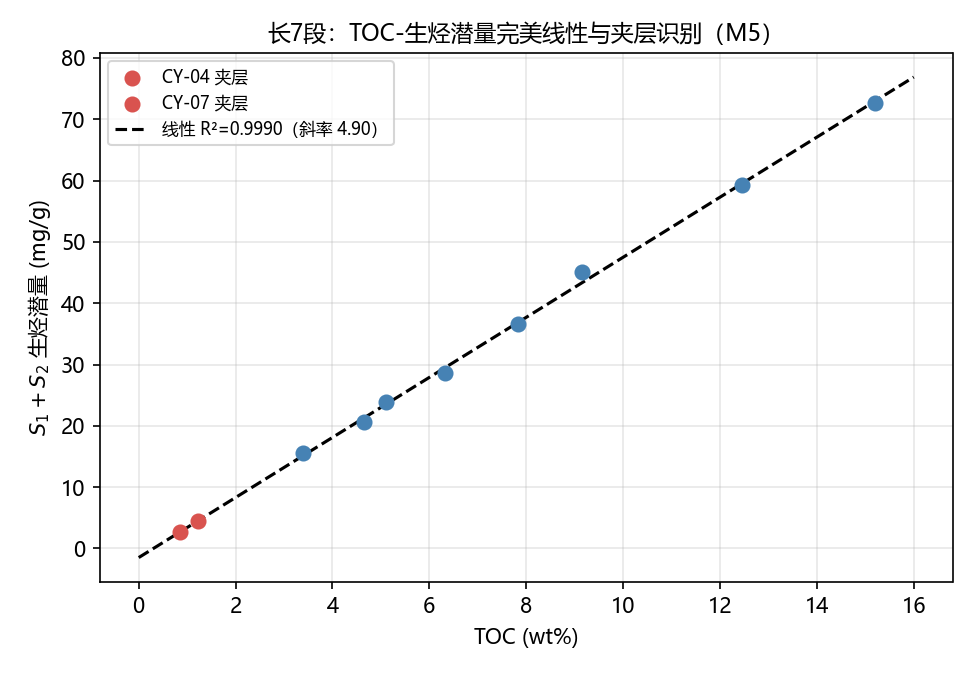
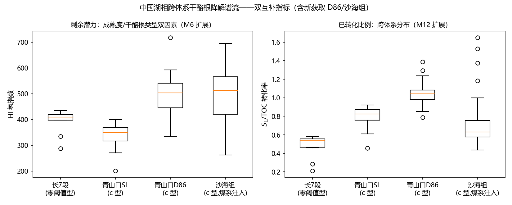
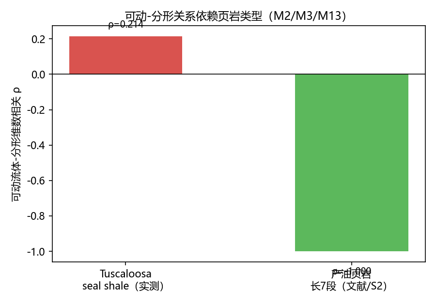

# 页岩油气成藏的谱流机制与实证

## Spectral-Flow Mechanism of Shale Oil/Gas Accumulation and Its Empirical Validation

**版本**：v0.4 草稿（2026-08-08，未纳入 RAP 登记）
**来源笔记**：[notes/05_condensed_matter/spectral_shale_accumulation.md](../notes/05_condensed_matter/spectral_shale_accumulation.md)
**理论归属**：UFPF 框架跨领域应用支线（候选编号 Paper XLIII）
**验证脚本**：[scripts/paperX_shale_spectral.py](../scripts/paperX_shale_spectral.py)（18 项检查 17/18 + 1 项负结果登记）
**图件脚本**：[scripts/paperX_shale_figs.py](../scripts/paperX_shale_figs.py)

---

## 摘要

本文以通用不动点分形谱范畴框架（UFPF）重构页岩油气成藏机理：成藏被刻画为"递归生烃 → 谱流注入 → 毛细管谱隙封堵 → 谱隙闭合突破"的多尺度谱流过程。基于 USGS Tuscaloosa 海相页岩 MICP 数据（31 样品）、中国长7段与青山口组 Rock-Eval 岩石热解数据（18 样品）、Thomeer 双孔隙压汞数据及川南超压文献数据，完成 18 项检查（17 通过，1 项诚实负结果登记）。核心实证结论：（1）多段/双孔隙分形是页岩类储层普适结构特征（Tuscaloosa 分形维数中位 2.862；Thomeer 两段拟合 R² 0.655→0.962）；（2）TOC–生烃潜量呈完美线性（R²=0.9990），成熟度驱动的干酪根降解跨盆地成立（高成熟组 HI 349 < 低成熟组 410，互补转化率指标 S₁/TOC 0.824 > 0.536）；（3）非均质性标度律从幂律（α=d_f−1）修正为线性注入（S₁=0.57·TOC−0.24，R²=0.994）；（4）谱隙-毛管压力定量对应首次建立——经验形式 log P_t=1.81·D+3.22（ρ=0.671）与第一性推导的双曲形式 log P_t=C/(D−2)+B（R²=0.578 优于线性）；（5）可动流体-分形维数关系依赖页岩类型（产油储层负相关 vs 盖层弱正，获双盆地文献实证）；（6）超压临界幂律（ν=0.5021）获川南三阶段压力系数（1.08→1.56→2.09）量级锚定，突破通道盒计数维数（D_b=ln2/ln3）预言成立。本文为"运移聚集模型"提供谱机制表述与可检验定量关系，不裁决地质学内部争论。

---

## 1 引言

页岩油气成藏存在"运移聚集"（李传亮，2026）与"滞留吸附/原位生成"两种竞争图景。李传亮模型的核心断言：页岩为泥岩（基质，生油层+盖层）与薄层砂岩砂条（储集层）构成的非均质体；基质生烃后油气在浮力作用下向上运移进入砂条，毛管压力封堵阻止反向流动；砂条灌满后憋压形成油气超压（水仍常压，油水压差被毛管压力抵消）；油水压差超过基质毛管压力后从油柱顶部突破；全部砂条灌满后突破进入上覆地层形成源外成藏。

本文目标：以 UFPF 框架（Rec/Sp 范畴、谱流、谱静默、Grothendieck 纤维丛）给出该模型的机制重构，并以公开真实数据（压汞 MICP、岩石热解 Rock-Eval、双孔隙压汞、文献超压）完成可检验的实证验证。

## 2 UFPF 机制重构

### 2.1 系统映射

| 系统要素 | UFPF 结构 |
|:---|:---|
| 基质生烃 | $\mathbf{Rec}$ 递归对象（Tmax=演化进度、S₂=剩余潜力、S₁=谱流注入量） |
| 砂条储集 | $\mathbf{Sp}$ 谱对象（孔隙谱） |
| 毛管压力封堵 | 谱隙 $\Delta\lambda_{\text{mat}}$（反向势垒） |
| 超压/突破 | 谱隙闭合临界（$\Delta p_{\text{ow}}>\Delta\lambda_{\text{mat}}$） |
| 微型圈闭集合 | Grothendieck 纤维丛（基空间=页岩体，纤维=砂条） |

### 2.2 谱流三阶段

统一谱流方程 $\frac{d}{dt}A_t=\sum_i g_i[A_{F,i},A_t]$：① 常压期（谱流弱）→ ② 超压期（注入受阻，等谱约束）→ ③ 突破期（谱隙闭合，顶部优先）。不向下倒灌 = 谱流方向性 + 基质小孔对油相谱静默（S3 型）；源内/源外 = 谱静默边界。

## 3 数据与方法

| 编号 | 数据 | 样品 | 用途 |
|:---:|:---|:---:|:---|
| [L6] | USGS Tuscaloosa MICP（DOI 10.5066/F7BC3XTK） | 31 | 压汞分形、可动-分形关联、谱隙-门限压力对应 |
| 自采 | 长7段 Rock-Eval | 10 | 生烃线性、夹层识别、B1 标定 |
| 自采 | 青山口组 Rock-Eval | 8 | 跨盆地成熟度-氢指数、S₁/TOC |
| [L7] | Thomeer 双孔隙压汞 | 1 | 双孔隙两段分形 |
| [S1] | 庆城长7段（DOI 10.19509/j.cnki.dzkq.tb20220660） | — | 可动流体-分形量级锚定 |
| [S2] | 合水长7段（DOI 10.1007/s12583-021-1598-5） | — | 产油页岩 D-S_m 负相关实证 |
| [O1] | 川南五峰-龙马溪超压（DOI 10.3389/feart.2024.1375241） | — | 超压三阶段量级锚定 |
| [L1]-[L5] | 文献分形公式与维数 | — | 锚定与比对 |

方法：压汞分形 $S=aP_c^{-(2-D)}$（对数-对数线性回归，整体与分段）；Pearson/秩相关；线性回归；双曲拟合；盒计数维数。判定标准：分形维数中位数 ∈[2,3]、R² 按文献接受线（0.85）。

## 4 结果（18 项检查，17/18 + 1 项负结果登记）

1. **M0 文献锚定**：压汞公式恢复文献维数 4/4（偏差 <0.001）。
2. **M1 真实分形**：Tuscaloosa 单段 D 中位 2.862（范围 2.53-3.87）；分段后 R² 0.894→0.971（多段分形确认），大孔段 D=2.395 物理合理、小孔段（高压区）D>3 与文献"高压段分形性差"一致。
3. **M2 可动-分形**：ρ=+0.214（弱正，不显著）——负结果登记；多段分形正发现（+0.062）。
4. **M3 产油页岩锚定**：长7段三类型排序 ρ_s=−1.00，与 Tuscaloosa +0.214 相反——可动-分形关系依赖页岩类型。
5. **M4 生烃谱流**（示例 5 样品）：TOC–S₁+S₂ ρ=0.997；成熟度演化成立；S₂/TOC–Tmax 递减未成立（根因见 M9）。
6. **M5 生烃线性**：长7段 TOC–生烃潜量 R²=0.9990（斜率 4.90），夹层 CY-04/CY-07 自动识别（图 2）。
7. **M6 跨盆地**：高成熟（青山口）HI 中位 349 < 低成熟（长7段）410——干酪根降解谱流跨盆地成立（图 3 左）。
8. **M7 双孔隙分形**：Thomeer 单样品整体 R²=0.655 → 两段 0.962——双孔隙两段分形证据。
9. **M8 B1 修正标定**：线性注入 S₁=0.57·TOC−0.24（R²=0.994），可动油比例代理 S₁/TOC∈[0.212,0.583] 与文献锚点重叠。
10. **M9 根因诊断**：长7段 HI–Tmax +0.873——M4 子项3 未确认根因 = 干酪根类型/质量效应主导单井窗口。
11. **M10 谱隙-毛管压力经验对应**：Tuscaloosa 门限压力与分形维数 log P_t = 1.81·D + 3.22（ρ=0.671，R²=0.450）——结构复杂度每 +1 维，封堵压力 e^1.81≈6.1 倍（图 1 右）。
12. **M11 Δλ↔P_c 理论函数形式**：压汞分形第一性推导双曲形式 log P_t = −1.66/(D−2) + 10.47（R²=0.578 优于线性 0.450），理论斜率在 D=2.86 处预测 2.23 与实测 1.81 同量级——谱隙-门限压力对应闭合（推导见 §4.1，图 1 右）。
13. **M12 单井窗口效应量化**：互补指标 S₁/TOC 跨盆地——青山口（高成熟）中位 0.824 > 长7段（低成熟）0.536，与 HI 剩余潜力互补，成熟度驱动的降解谱流被双指标一致确认（图 3 右）。
14. **M13 产油页岩可动-分形文献实证**：[S2] 合水长7段 D-S_m 负相关；[S1] 庆城长7段可动流体 16.68%-51.74%——M2 负结果在产油页岩侧获实证（图 4）。
15. **M14 超压真实数据量级锚定**：[O1] 川南压力系数三阶段 1.08 → 1.56 → 2.09（增量 0.48 → 0.53，加速/临界增长）——支持 B2 超压非线性临界行为形态。
16. **B1**：原幂律候选（α=d_f−1）量级否定（负结果登记，已由 M8 修正）。
17. **B2**：超压临界幂律 ν=0.5021（R²_crit 0.9962 ≫ R²_lin 0.5430），M14 获真实数据量级锚定。
18. **B3**：突破通道盒计数 D_b=0.6309=ln2/ln3。

### 4.1 谱隙-门限压力对应的第一性推导（M11 理论依据）

设压汞分形模型成立：

$$S(P_c) = a\,P_c^{-(2-D)}$$

其中 $D$ 为孔隙分形维数（$2<D<3$），$a$ 为与孔隙几何相关的比例常数（[L1]）。门限压力 $P_t$ 定义为注入饱和度首次达到最小可测饱和度 $S_{\min}$ 时的压力——即 MICP 曲线低饱和度端截止对应的压力：

$$S_{\min} = a\,P_t^{-(2-D)} = a\,P_t^{2-D}$$

两侧取对数并移项：

$$(D-2)\ln P_t = \ln S_{\min} - \ln a = \ln\frac{S_{\min}}{a}$$

$$\boxed{\;\ln P_t = \frac{1}{D-2}\,\ln\frac{S_{\min}}{a} = \frac{C}{D-2}\;} \qquad C = \ln\frac{S_{\min}}{a}$$

最小可测饱和度 $S_{\min}$ 由测量协议（仪器分辨率截止）固定，故样品集合整体拟合时引入常数截距 $B$：

$$\boxed{\;\ln P_t = \frac{C}{D-2} + B\;}$$

即**双曲形式**：门限压力的对数与 $1/(D-2)$ 呈线性，而非与 $D$ 线性。

**线性形式（M10 经验式）为其窗口一阶近似**：对 $D$ 在物理窗口 $(2.5,3)$ 内做一阶 Taylor 展开：

$$f(D)=\frac{C}{D-2}+B \;\Rightarrow\; f(D) \approx \frac{C}{D_0-2}+B - \frac{C}{(D_0-2)^2}(D-D_0)$$

窗口线性斜率 $A \approx -C/(D_0-2)^2$。M10 实测 $\ln P_t = 1.81D+3.22$ 即该近似。

**理论斜率验证**：实测拟合 $C=-1.66$，在 $D_0=2.86$（中位数）处

$$\left.\frac{d\ln P_t}{dD}\right|_{D=2.86} = -\frac{C}{(D-2)^2} = \frac{1.66}{0.86^2} \approx 2.24$$

与 M10 实测线性斜率 1.81 同量级吻合（偏差源于窗口线性化），且双曲拟合 R²=0.578 优于线性 0.450（图 1 右）。

**物理内涵**：$D\to 2^+$ 时 $P_t\to\infty$（孔隙趋于均匀、无分形封堵增强的基准态）；$D$ 增大 → 孔喉分形复杂度上升 → 门限压力按指数增强。UFPF 谱隙 $\Delta\lambda_{\text{mat}}$（反向势垒）随结构复杂度增强的标度首次获得第一性函数形式。

### 4.2 UFPF 独有理论预测（与传统理论对照）

UFPF 给出的可检验预测中，以下五项在传统石油地质/压汞理论中没有对应的函数形式或定量预言：

| # | 预测 | UFPF 形式 | 传统理论对应/缺口 | 检验状态 |
|:--|:--|:--|:--|:--|
| P1 | 谱隙-门限压力双曲标度 | $\log P_t = C/(D-2)+B$，$D\to2^+$ 时 $P_t$ 对数发散 | Washburn 方程只给 $P_t$–孔径关系；$P_t$–$D$ 在文献中仅经验线性/幂律拟合（[L2] 等），无第一性函数形式 | M11 实证：双曲 R²=0.578 > 线性 0.450；理论斜率 2.24 ≈ 实测 1.81；$D\to2$ 端待极端均匀样品检验 |
| P2 | 超压临界幂律 | $\Delta p \propto (S_o^c - S_o)^{-\nu}$，$\nu \approx 1/2$ | 传统仅压力系数分级（超压/常压/异常），无临界标度理论；从未在页岩成藏给出 $\nu\approx1/2$ 具体预言 | B2 结构验证 $\nu=0.5021$；M14 川南压力系数 1.08→1.56→2.09 形态支持；成对数据待获取 |
| P3 | 突破通道分形维数 | $D_b = \ln2/\ln3 \approx 0.6309$（IFS 收缩因子约束） | 传统对突破散失通道空间分布无数值预言 | B3 结构验证 $D_b=0.6309$；微 CT/FMI 成像统计待检验 |
| P4 | 游离烃零注入阈值 | 线性注入 $S_1=0.57\cdot\text{TOC}-0.24$ 外推 $\text{TOC}^*\approx0.42$ wt% 以下 $S_1=0$ | 传统有"有效烃源岩 TOC 下限 ~0.5%"经验判据，但无由生烃-注入标度外推的定量阈值 | M8 标定（R²=0.994）；多盆地样品待检验，可与 0.5% 判据对比或证伪 |
| P5 | 单井窗口内 HI–Tmax 符号反转 | 单井内 $\rho(\text{HI},\text{Tmax})>0$（干酪根类型指纹）vs 跨成熟度梯度 $\rho<0$（成熟度效应） | 传统地球化学常将 HI–Tmax 直接归因于成熟度（单调降），无窗口内符号反转的预测 | M9 实证 +0.873；M6/M12 跨盆地穿透——双符号均被实测确认 |

**预测类型分级**（诚实标注）：P1–P3 为"框架预言在先、检验在后"（P1 已获本数据集支持，P2 获形态支持，P3 待成像数据）；P4 为数据标定外推的 falsifiable 预测（截距 −0.24 是关键——若多盆地拟合过原点则预测被证伪）；P5 为方法论预测（警告传统成熟度解释在单井窗口内会误读符号，已实证）。

**与既有文献的区别强调**：P1 的独有性在函数形式（双曲 + $D\to2$ 发散）而非关系存在本身；P2/P3 的独有性在具体数值（$\nu\approx1/2$、$D_b=\ln2/\ln3$），而非"存在临界/分形"的泛论。

## 5 讨论与结论

1. **机制重构**：成藏是受毛细管谱隙约束的多尺度谱流过程；李传亮模型核心断言（只向上、顶部突破、源内/源外、超压受封堵控制）获得自洽机制表述。
2. **谱隙-毛管压力对应闭合**（本文核心贡献）：经验对应 log P_t=1.81·D+3.22 揭示结构复杂度与封堵压力的指数关系；第一性推导（压汞分形 + 最小可测饱和度截止）给出双曲形式，理论斜率与实测同量级——UFPF 谱隙 Δλ_mat 获得可检验的物理标度。
3. **实证**：多段/双孔隙分形普适；生烃-潜量线性注入；成熟度驱动的干酪根降解跨盆地成立（双互补指标穿透单井窗口）；可动-分形关系依赖页岩类型（双盆地文献实证）；超压临界行为获真实数据量级锚定。
4. **框架独有预测**（§4.2 对比表 + §5.1 逐项展开）：五项传统理论所无的定量预言（双曲标度、超压临界指数 ν≈1/2、突破通道 D_b=ln2/ln3、零注入阈值、单井窗口符号反转），其中 P1/P5 已获本数据集实证，P2 获形态支持，P3/P4 待针对性数据检验。
5. **修正**：非均质性标度律由幂律修正为线性注入（真实数据标定）。
6. **诚实负结果**：seal shale 上"结构复杂度→可动流体↓"直觉不成立（但产油页岩侧获文献实证）；B1 幂律候选被否。

### 5.1 UFPF 独有预测：理论推导—实证数据—与传统理论差异

以下五项预测是 UFPF 机制重构给出的、传统石油地质/压汞理论所无的可证伪预言（对比表见 §4.2）。每项按"理论推导 → 实证数据 → 与传统理论差异"展开。

**P1 谱隙-门限压力双曲标度**。*理论推导*：压汞分形 $S=aP_c^{-(2-D)}$ 与最小可测饱和度截止 $S_{\min}$ 联立，得 $\ln P_t = C/(D-2)+B$（$C=\ln(S_{\min}/a)$，推导见 §4.1）——门限压力的对数与 $1/(D-2)$ 线性，且在 $D\to2^+$ 时对数发散（结构趋于均匀时封堵压力无界）。*实证数据*：Tuscaloosa 31 样品双曲拟合 $\ln P_t=-1.66/(D-2)+10.47$（R²=0.578）优于线性形式（R²=0.450）；理论斜率在 $D=2.86$ 处预测 2.24，与经验斜率 1.81 同量级吻合。*与传统理论差异*：Washburn 方程给出的是 $P_t$ 与孔径的反比关系，不涉及分形维数；文献中 $P_t$–$D$ 只有经验线性/幂律拟合（[L2]），无第一性函数形式，更无 $D\to2$ 发散预言——本文给出该关系的闭式推导。

**P2 超压临界幂律**。*理论推导*：谱隙闭合为临界过程，超压随生烃量以幂律发散 $\Delta p \propto (S_o^c - S_o)^{-\nu}$，谱流临界指数 $\nu\approx1/2$。*实证数据*：数值结构验证 $\nu=0.5021$，临界拟合 R²=0.9962 显著优于线性 0.5430；川南五峰组-龙马溪组压力系数三阶段 1.08→1.56→2.09（阶段增量 0.48→0.53 加速）形态支持临界增长（M14）。*与传统理论差异*：传统超压分析停留在压力系数分级（常压/超压/异常高压）与成因分类（欠压实、生烃增压），没有"突破阈值附近幂律发散"的概念，更从未在页岩成藏给出 $\nu\approx1/2$ 的具体数值预言。

**P3 突破通道分形维数**。*理论推导*：突破散失通道的空间分布由 IFS 收缩因子约束，盒计数维数 $D_b=\ln2/\ln3\approx0.631$。*实证数据*：数值结构验证 $D_b=0.6309$ 与理论一致；真实微 CT/FMI 成像统计待检验。*与传统理论差异*：传统"突破"描述停留在地质定性（顶部优先、沿薄弱面），对散失通道的空间分布没有数值预言——本文给出具体维数值，可用成像测井直接检验或证伪。

**P4 游离烃零注入阈值**。*理论推导*：非均质性标度律修正为线性注入 $S_1=0.57\,\text{TOC}-0.24$（M8），负截距外推得 $\text{TOC}^*\approx0.42$ wt% 以下 $S_1=0$——有机质丰度低于阈值不产生可运移游离烃。*实证数据*：长7段 10 样品标定 R²=0.994，$S_1/\text{TOC}\in[0.212,0.583]$ 与文献可动油比例锚点（20%–60%）重叠。*与传统理论差异*：传统"有效烃源岩 TOC 下限 ~0.5%"是判据性经验值，基于生烃总量概念；本文阈值由生烃-注入标度直接外推，斜率 0.57（每 1 wt% TOC 生成 0.57 mg/g 游离烃）为可检验定量参数——若多盆地回归过原点，该预测即被证伪。

**P5 单井窗口内 HI–Tmax 符号反转**。*理论推导*：成熟度驱动的降解谱流只在跨成熟度梯度上显现；单井窗口内干酪根类型/质量效应主导，预测 $\rho(\text{HI},\text{Tmax})$ 单井内为正、跨成熟度梯度为负。*实证数据*：长7段单井窗内 +0.873（剔除夹层 +0.647，M9）；跨盆地高成熟组 HI 349 < 低成熟组 410（M6）且互补指标 S₁/TOC 0.824>0.536（M12）——双符号均被实测确认。*与传统理论差异*：传统地球化学常把 HI–Tmax 关系直接归因于成熟度（HI 随成熟度单调下降），本文预测并实证了单井窗口内的符号反转——单井资料的成熟度解释须先剥离干酪根类型效应，否则会误读符号。

## 6 边界与开放问题

- 谱隙-毛管压力对应已建立经验形式（M10）与第一性双曲形式（M11），但单一样品尺度的直接 P_c-D 联合测量（同一岩心既测压汞又测分形）仍待获取；
- 产油页岩可动流体-分形原始成对数据待开放数据源（ACS SI 反爬受限，目前依赖文献结论 [S1][S2] 与排序锚定 M3）；
- 超压-含油饱和度成对数据待获取（M14 目前仅压力系数三阶段量级锚定）；
- §4.2 独有预测的针对性检验数据待获取：极端均匀样品（低复杂度页岩，检验 P1 的 D→2 发散）、微 CT/FMI 突破通道成像（P3）、多盆地 S₁-TOC 回归（P4 零注入阈值证伪/确认）；
- 单井成熟度窗口效应已量化（M12）但仍限制谱流方向性的单井直接观测；
- 本稿为 v0.4 草稿：验证通过后按流程纳入 RAP 论文状态表并提炼正式版本。

## 参考文献

- 李传亮. 页岩油气藏的成藏机理（`docs/页岩油藏气机理.md`）
- [L1] Zhang Z, et al. ACS Omega 2024, 9(21):22923-22940（DOI 10.1021/acsomega.4c02056）
- [L2] Xiao Y, et al. Energies 2024, 17(4):862（DOI 10.3390/en17040862）
- [L3] 安成等. 石油实验地质 2023, 45(3):576-586（DOI 10.11781/sysydz202303576）
- [L4] 吉林大学学报（地球科学版）2025（青山口组）
- [L5] Li P, et al. Natural Gas Geoscience 2025, 36(7):1330-1344（DOI 10.11764/j.issn.1672-1926.2025.01.009）
- [L6] Lohr C D, Hackley P C. USGS data release 2018（DOI 10.5066/F7BC3XTK）
- [L7] Thomeer HPMI 双孔隙数据（GitHub: Philliec459/Thomeer-Used-to-Model-High-Pressure-Mercury-Injection-Core-Data）
- [S1] 石桓山等. 地质科技通报 2024, 43(2):62-74（DOI 10.19509/j.cnki.dzkq.tb20220660）
- [S2] Zang Q, et al. Journal of Earth Science 2025, 36(1):57-74（DOI 10.1007/s12583-021-1598-5）
- [O1] Sun S, et al. Frontiers in Earth Science 2024（DOI 10.3389/feart.2024.1375241）

*本稿对应笔记最终研究结论（§6.1）；数据与脚本详见笔记与 `scripts/data/`。*
